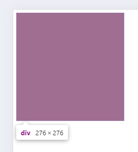

# vh单位

vh单位,是**相对视口高度**的计算结果,可以直接实现移动端适配效果

1vh=1/100视口高度

例子:

```html
<div></div>
```

```css
div {
    width: 50vh;
    height: 50vh;
    background-color: red;
}
```



## 问题

vw和vh不能混用,vh是视口高度,**全面屏视口高度尺寸大**,如果混用可能导致**盒子变形**