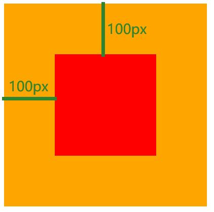
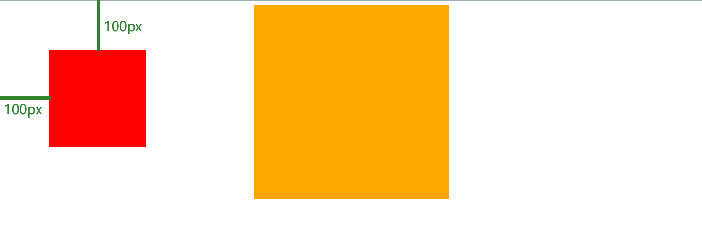
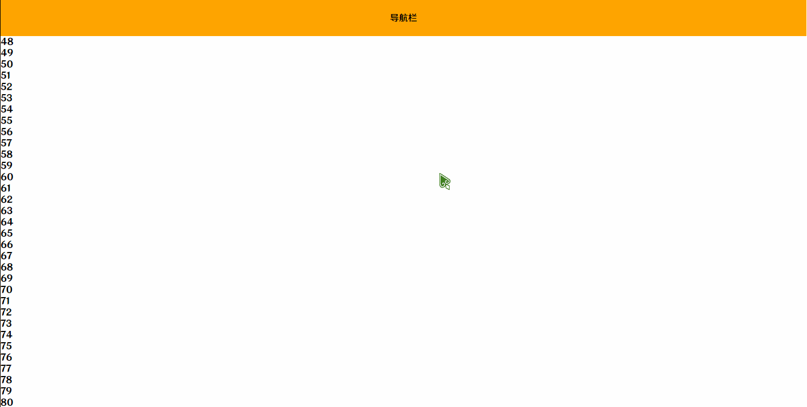

# 定位

作用:灵活的**改变**盒子在网页中的**位置**

实现:

1. 定位模式:`position`

2. 偏移量:设置盒子的位置

   1. `left`
   2. `right`
   3. `top`
   4. `bottom`

## 相对定位

`position: relative;`

元素先放置在未添加定位时的位置,再在不改变页面布局的前提下调整元素位置(因此会在此元素未添加定位时所在位置留下空白)

`position:relative`对`table-*-group`,`table-row`,`table-column`,`table-cell`,`table-caption`元素无效

例子:

```html
<div class="a">
    <div class="b"></div>
</div>
```

```css
.a {
    width: 400px;
    height: 400px;
    background-color: orange;
}

.b {
    position: relative;
    top: 100px;
    left: 100px;
    width: 200px;
    height: 200px;
    background-color: red;
}
```



## 绝对定位

`position: absolute;`

元素会被移出正常文档流,并不为元素预留空间,通过指定元素相对于最近的非`static`定位祖先元素的偏移,来确定元素位置.绝对定位的元素可以设置外边距`margins`,且不会与其他边距合并

使用场景:**子级**绝对定位,**父级**相对定位

例子1(直接使用绝对定位):

```html
<div class="a">
    <div class="b"></div>
</div>
```

```css
.a {
    margin: auto;
    width: 400px;
    height: 400px;
    background-color: orange;
}

.b {
    position: absolute;
    top: 100px;
    left: 100px;
    width: 200px;
    height: 200px;
    background-color: red;
}
```



例子2(子级绝对定位,父级相对定位):

```html
<div class="a">
    <div class="b"></div>
</div>
```

```css
.a {
    margin: auto;
    position: relative;
    width: 400px;
    height: 400px;
    background-color: orange;
}

.b {
    position: absolute;
    top: 100px;
    left: 100px;
    width: 200px;
    height: 200px;
    background-color: red;
}
```


## 定位居中

实现步骤:

1. 绝对定位
2. 水平,垂直偏移量为`50%`
3. **子级**向左,上移动**自身尺寸**的**一半**
   * 左,上的外边距为 -尺寸的一半
   * `transform: translate(-50%, -50%)`方便

例子:

```html

```

```css
img{
    position: absolute;
    top: 50%;
    left: 50%;

    /* 第一种方法 */
    margin-top: -250px;
    margin-left: -250px;

    /* 第二种方法 */
    transform: translate(-50%, -50%)
}
```


## 固定定位

`position: fixed`

元素会被移出正常文档流,并不为元素预留空间,而是通过指定元素相对于屏幕视口(viewport)的位置来指定元素位置.元素的位置在屏幕滚动时不会改变

场景:顶部导航栏,随着滚动条滚动,固定在顶部

例子:

```html
<div>导航栏</div>
<p>1</p>
<p>2</p>
<p>3</p>
<p>4</p>
<p>5</p>
<p>6</p>
<p>7</p>
<p>8</p>
<p>9</p>
<p>10</p>
(省略90个p标签,VSCode可以输入 p{$}*100 快速生成)
```

```css
div{
    position: fixed;
    width: 100%;
    height: 64px;
    background-color: orange;
    text-align: center;
    line-height: 64px;
}
```

