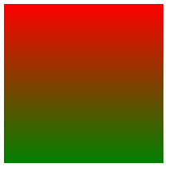
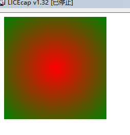

# 渐变

渐变是**多个颜色**逐渐变化的效果,一般用于设置**盒子背景**

## 线性渐变

`background-image: linear-gradient(渐变方向, 颜色1 终点位置, 颜色2 终点位置, ...);`

* 渐变方向:可选
  * to 方位代名词
  * 角度度数
* 终点位置:可选
  * 百分比

例子:

```html
<div></div>
```

```css
div{
    width: 200px;
    height: 200px;
    background-image: linear-gradient(red, green);
}
```



## 径向渐变

`background-image: radial-gradient(半径 at 圆心位置, 颜色1 终点位置, 颜色2 终点位置, ...);`

半径可以是**2条**,则为**椭圆**

圆心位置取值:数值,百分比,方位名词

例子:

```html
<div></div>
```

```css
div{
    width: 200px;
    height: 200px;
    background-image: radial-gradient(red,green)
}
```



## 老规矩

一样推荐几个网站,这两个网站都很推荐

[渐变色卡1](https://webkul.github.io/coolhue/)

[渐变色卡2](https://gradient.shapefactory.co/)

然后顺便放一个中国风的纯色色卡网站

[zhongguose传统颜色](http://zhongguose.com/)
