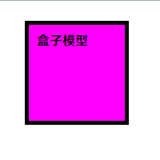
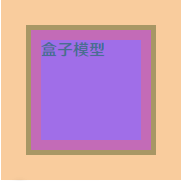
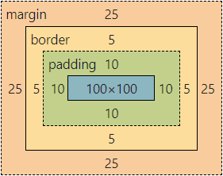

# 盒子模型

作用:布局网页,摆放盒子和内容

## 组成

内容区域 -`width`,`height`

内边距 -`padding`(出现在内容与盒子边缘之间)

边框线 -`border`

外边距 -`margin`(出现在盒子外面)

例子:

```html
<div>盒子模型</div>
```

```css
div{
    padding: 10px;
    margin: 25px;
    width: 100px;
    height: 100px;
    border: 5px solid black;
    background-color: fuchsia;
}
```







## 内边距

在盒子内部加入边距

`padding: 四面八方`

`padding: 上下 左右`

`padding: 上 左右 下`

`padding: 上 右 下 左`

还可以直接加入方向

`padding-top`:上

`padding-right`:右

`padding-bottom`:下

`padding-left`:左

例:

`padding: 10px`:在盒子的四面八方加入10像素的边距

`padding: 10px 20px`:在盒子的上下加入10像素的边距,左右加入20像素的边距

`padding: 10px 20px 30px`:在盒子的上方加入10像素的边距,左右加入20像素的边距,下方加入30像素的边距

`padding: 10px 20px 30px 40px`:在盒子的上方加入10像素的边距,右侧加入20像素的边距,下方加入30像素的边距,左侧加入40像素的边距

注意:

加入内边距后,会撑大盒子,可以设置为内减模式`box-sizing: border-box`

## 行内元素

场景:**行内**元素添加**margin**和**padding**，无法改变元素**垂直**位置

解决方法:给行内元素添加**line-height**可以改变垂直位置

## 边框线

给盒子加入边框

`border: 边框线粗细 线条样式 颜色`(不分先后顺序)

还可以直接加入方向

`border-top`:上

`border-right`:右

`border-bottom`:下

`border-left`:左

线条样式:

`solid`:实线

`dashed`:虚线

`dootted`:点线

例:

`border: 5px solid black`:给盒子加入5像素实心的边框线

注意:

加入边框线后,会撑大盒子,可以设置为内减模式`box-sizing: border-box`

## 外边距

在盒子外部加入边距

`margin: 四面八方`

`margin: 上下 左右`

`margin: 上 左右 下`

`margin: 上 右 下 左`

还可以直接加入方向

`margin-top`:上

`margin-right`:右

`margin-bottom`:下

`margin-left`:左

例:

`margin: 10px`:在盒子的四面八方加入10像素的边距

`margin: 10px 20px`:在盒子的上下加入10像素的边距,左右加入20像素的边距

`margin: 10px 20px 30px`:在盒子的上方加入10像素的边距,左右加入20像素的边距,下方加入30像素的边距

`margin: 10px 20px 30px 40px`:在盒子的上方加入10像素的边距,右侧加入20像素的边距,下方加入30像素的边距,左侧加入40像素的边距

注意:

### 合并现象:

场景:**垂直**排列的**兄弟**元素,**上下**`margin`**会合并**

现象:取两个`margin`中的**较大值**生效

### 塌陷现象

场景:**父子级**的标签,**子级**的添加**上外边距**会产生**塌陷**问题

现象:导致父级一起向下移动

解决办法:

1. **取消子集margin**,**父级**设置**padding**
2. **父级**设置`overflow: hidden`
3. **父级**设置`border-top`

## 尺寸计算

默认情况下

盒子尺寸 = 内容尺寸 + 边框线尺寸 + 内边距尺寸

例如最开始的例子,盒子尺寸就是 130*130

如果使用了内减模式

盒子尺寸 = 内容尺寸

例如最开始的例子,盒子尺寸就是 100*100

