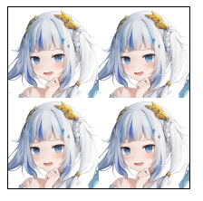
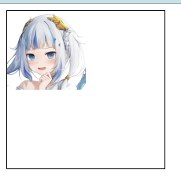
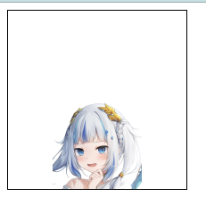
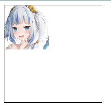

# 背景样式

## 背景色

属性名:`background-color`

例子:

```html
<div></div>
```

```css
div {
    width: 200px;
    height: 200px;
    background-color: red;
}
```


## 背景图

属性名:`background-image`

例子:

```html
<div></div>
```

```css
div {
    width: 200px;
    height: 200px;
    background-image: url('image.png');
    border: 1px solid black;
}
```



## 背景图平铺方式

属性名:`background-repeat`

属性值:

|   属性值    |     效果     |
| :---------: | :----------: |
| `no-repeat` |    不平铺    |
|  `repeat`   |  平铺(默认)  |
| `repeat-x`  | 水平方向平铺 |
| `repeat-y`  | 垂直方向平铺 |

例子:

```html
<div></div>
```

```css
div {
    width: 200px;
    height: 200px;
    background-image: url('image.png');
    background-repeat: no-repeat;
    border: 1px solid black;
}
```



## 背景图位置

属性名:`background-position`

属性值(水平方向 垂直方向):

关键词:

|  属性值  | 效果 |
| :------: | :--: |
|  `left`  | 左侧 |
| `right`  | 右侧 |
| `center` | 居中 |
|  `top`   | 顶部 |
| `bottom` | 底部 |

坐标,数值,正负都可以

例子:

```html
<div></div>
```

```css
div {
    width: 200px;
    height: 200px;
    background-image: url('image.png');
    background-repeat: no-repeat;
    background-position: center bottom;
    border: 1px solid black;
}
```



## 背景图缩放

属性名:`background-size`

属性值:

关键词:

|  属性值   |                           效果                            |
| :-------: | :-------------------------------------------------------: |
|  `cover`  | 等比例缩放背景图片以完全覆盖背景区,可能背景图片部分看不见 |
| `contain` |   等比例缩放背景图片以完全装入背景区,可能背景区部分空白   |

百分比,感觉盒子大小计算图片大小

数值,正负都可以

例子:

```html
<div></div>
```

```css
div {
    width: 200px;
    height: 200px;
    background-image: url('image.png');
    background-repeat: no-repeat;
    background-position: center bottom;
    background-size: contain;
    border: 1px solid black;
}
```


## 背景图固定

属性名:`background-attachment`

属性值:`fixed`

例子:

```html
<div></div>
```

```css
div {
    width: 200px;
    height: 200px;
    background-image: url('image2.png');
    background-repeat: no-repeat;
    background-attachment: fixed;
    border: 1px solid black;
}
```



## 背景复合属性

属性名:`background`

属性值:背景色 背景图 背景图平铺方式 背景图位置/背景图缩放 背景图固定(空格隔开各属性值,不分顺序)

```html
<div></div>
```

```css
div {
    width: 200px;
    height: 200px;
    background: url(image.png) no-repeat 100% 100%/100% 100%;
    border: 1px solid black;
}
```


