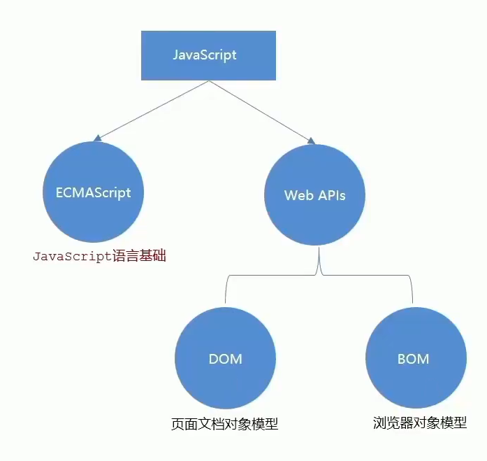

# 前言

> 本文档编写于2024年2月2号

**Js**全称**JavaScript**,是一门跨平台,面向对象的脚本语言,它能使网页可交互(例如拥有复杂的动画,可点击的按钮,通俗的菜单等).

另外还有高级的服务端**Js**版本例如**Node.js**,它可以让你在网页上添加更多功能,不仅仅是下载文件(例如在多台电脑之间的协同合作).在宿主环境(例如web浏览器)中,**Js**能够通过其所连接的环境提供的编程接口进行控制.

**Js**内置了一些对象的标准库,比如数组(`Array`),日期(`Date`),数学(`Math`)和一套核心语句,包括运算符,流程控制符以及声明方式等.**Js**的核心部分可以通过添加对象来扩展语言以适应不同用途,例如:

* 客户端的**Js**通过提供对象,控制浏览器及其文档对象模型(DOM),来扩展语言核心.例如:客户端的拓展代码允许应用程序将元素放在某个HTML表单中,并且支持响应用户事件,比如鼠标点击,表单提交和页面导航.
* 服务端的**Js**则通过提供有关在服务器上运行**Js**的对象来可扩展语言核心.例如:服务端版本直接支持应用和数据库通信,提供应用不同调用间的信息连续性,或者在服务器上执行文件操作.

这意味着,在浏览器中,**Js**可以改变网页(DOM)的外观与样式.同样地,在服务器上,**Node.js**中的**Js**可以对浏览器上编写的代码发出的客户端请求做出响应.

## JavaScript和Java

**JavaScript**和**Java**有一些共性,但是在另一些方面有着根本性区别.**JavaScript**语言类似**Java**但是并没有**Java**的静态类型和强类型检查特性.**JavaScript**遵循了**Java**的表达式语法,命名规范以及基础流程控制,这也是**JavaScript**从**LiveScript**更名的原因.(除了上面说的共性外**JavaScript**和**Java**仅仅只是蹭热度的关系)

Ps:说了这么多,反正只用知道,这两B玩意没任何关系,名字也只是因为历史原因冲突的

## JavaScript的组成

### ECMAScript

规定了**Js**基础语法核心知识.

比如:变量,分支语法,循环语法,对象等等

## Web APIs:

DOM 操作文档,比如对页面元素进行移动,大小,添加删除等操作

BO 操作浏览器,比如页面弹窗,检测窗口宽度,存储数据到浏览器等等

