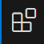
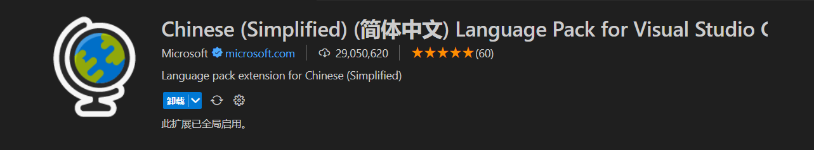
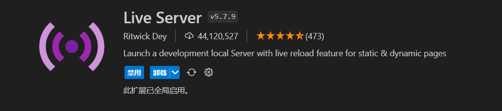
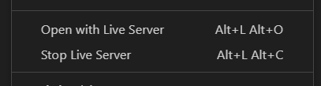
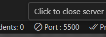

# 开发环境

编辑器推荐使用**Sublime Text**,**WebStorm**,**HBuilder**,**Visual Studio Code**

浏览器推荐使用**chromegw**,**Edge**

本教程使用**Visual Studio Code**和**Edge**进行讲解

**Visual Studio Code**简称**VS Code**是由微软开发的免费开源的代码编辑器(我更喜欢归为文本编辑器)

它支持多种编程语言,拥有丰富的扩展生态系统,并且几乎全平台

安装的时候,记得关联文件资源管理器就可以了

详细可看VS Code的那篇教程

[官网地址](https://code.visualstudio.com/)

**Edge**也是由微软开发的,Win10自带

[官网地址](https://www.microsoft.com/zh-cn/edge)

## VS Code插件

VS Code需要安装两个插件

点击侧边栏的这个图标(Ctrl + Shift + X) 

### 中文汉化

第一个:`Chinese (Simplified) (简体中文) Language Pack for Visual Studio Code`

### 内网运行

第二个:`Live Server`

安装完重启VS Code即可

第一个插件不用说,应该也知道是汉化VS Code的插件了,而第二个,是打开一个内网的创建,方便我们实时编写浏览网页

在`.html`或者`.htm`后缀的文件,右键鼠标,可以看见右键菜单里,多了两项

Open with Live Server 是打开网页

Stop Live Server 就是关闭了

正常来说,打开网页后,浏览器会自动跳转,没有自动跳转也没关系,在浏览器输入内网网址也可以,默认为`http://localhost:5500`

5500是端口号,在VS Code右下角可以看见,点击这个也可以关闭或打开网页

