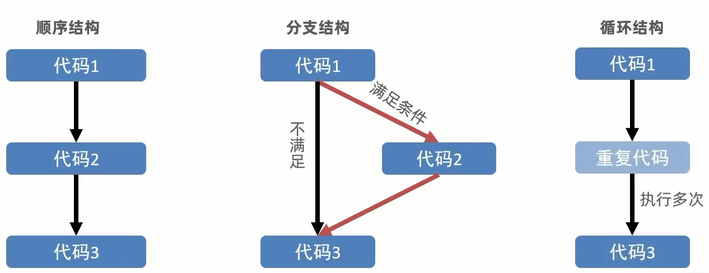

# 表达式和语句

## 表达式

表达式是可以被求值的代码,Js引擎会将其计算出一个结果

```js
x = 7
3 + 4
Num++
Num = 3 + 4
```

这些可以被求值的都是表达式

## 语句

语句是一段可以执行的代码

```js
prompt()
alert()
console.log()
if()
```

这些可以执行的代码都是语句

在某些情况下,表达式也可以理解为语句,因为它是在计算结果,但不是必要的成分.例如`continue`语句

### 三大流程控制语句

以前写的代码,写几句,就从上往下执行几句,这种叫顺序循环

有的时候要根据条件选择执行代码,这种就叫分支结构

某段代码被重复执行,就叫循环结构



## 分支语句

分支语句可以让我们有**选择性**的执行想要的代码

分支语句包含

* [If分支语句](Tutorials/JavaScript/If语句.md)
* [三元运算符](Tutorials/JavaScript/三元运算符.md)
* [Switch语句](Tutorials/JavaScript/Switch语句.md)
