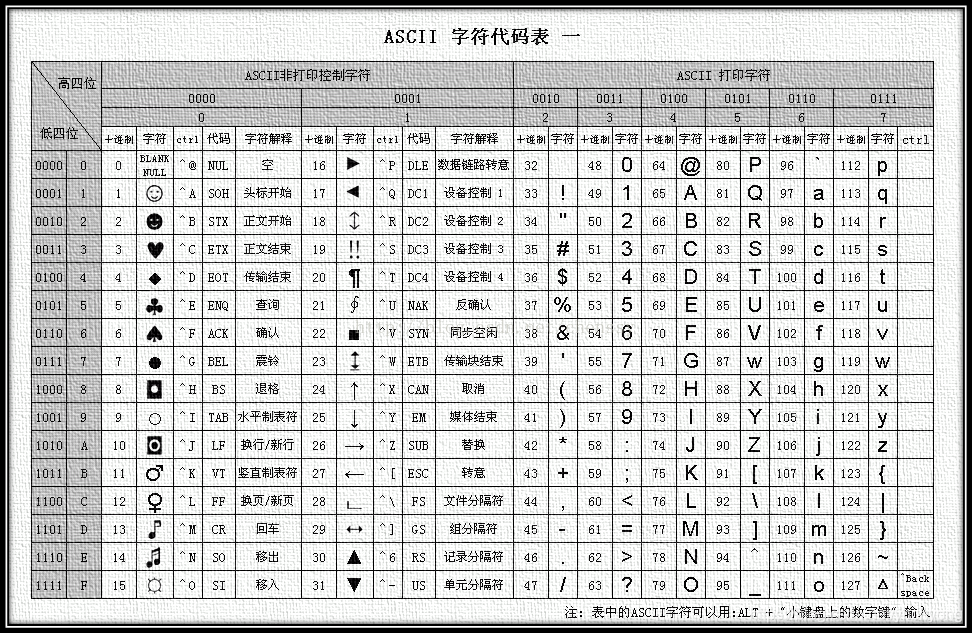

# 运算符

## 赋值运算符

对变量进行赋值的运算符

`=`:将等号右边的值赋予给左边,要求左边必须是个容器

其他赋值运算符

`+=`:左边的容器加上右边的值

`-=`:左边的容器减去右边的值

`*=`:左边的容器乘以右边的值

`/=`:左边的容器除以右边的值

`%=`:左边的容器求余右边的值

使用这些运算符可以在对变量赋值时进行快速操作

```js
let Num = 1
// 正常来说如果想要让Num加4,要写成这样
Num = Num + 4
// 如果我们使用了赋值运算符可以简化为
Num += 4
```

## 一元运算符

众多的Js运算符可以根据所需表达式的个数,分为一元运算符,二元运算符,三元运算符

举个例子,`let Num = 10 + 20`就是二元运算符

一元运算符有

* 正负号
* 自增
  * 符号:`++`
  * 作用:让容器的值加1
* 自减
  * 符号:`--`
  * 作用:让容器的值减1
* 非(取反)
  * 符号:`!`
  * 详细请看下面的[逻辑运算符](#逻辑运算符)


自增和自减经常用于**计数**使用

```js
let Num = 1
// 在我们学习赋值运算符前,如果要给变量加+1,是这样写的
Num = Num + 1
// 在我们学习赋值运算符后,可以简化为
Num += 1
// 而现在,我们可以使用一元运算符的自增再次简化,写出这样
Num++
```

要注意,无论是自增和还是自减,单次只能+1或-1,不能自定义值

### 扩展

我们可以分别做两个小实验

前置自增

```js
let Num = 1
console.log(Num) // 1
console.log(Num++) // 1
console.log(Num) // 2
```

后置自增

```js
let Num = 1
console.log(Num) // 1
console.log(++Num) // 2
console.log(Num) // 2
```

看出什么问题了么,是的在执行自增或自减时,一元运算符的位置会导致输出的结果不一致,这个现象其实很好理解

我们先来讲前置自增`Num++`,可以看见容器是在一元运算符的左侧的,如果这个时候我们打印返回的值,系统会先输出变量`Num`后在执行`++`

也就是说,`console.log(Num++)`输出的是变量`Num`的值,并不是`Num++`的结果

由此,我们可以推断出,后置自增`console.log(++Num)`是先执行了`++`,然后在输出变量`Num`的

另外`++Num++`这种写法是不允许的,会报错

这个扩展只需要理解即可,在实际开发中,不会输出一元运算符时容器的值的,都是直接写`Num++`

### 来让我考考你

```js
let Num = 1
console.log(Num++ + ++Num + Num + Num--)
console.log(Num)
```

请充当一下人形解析器(不做人了),分别说出它输出了什么

答案:10,2

解析:

第一问:1 + 3 + 3 + 3 = 10

第二问:1 + 1 = 2; 1 + 2 = 3; 3 - 1 = 2

## 比较运算符

用于比较两个数据大小,是否相等

`>`:左边是否大于右边

`<`:左边是否小于右边

`>=`:左边是否大于或等于右边

`<=`:左边是否小于或等于右边

`==`:**左右两边是否相等**

`===`:**左右两边是否全等(类型和值都相等)**

`!=`:左右两边是否不相等

`!==`:左右两边是否不全等(类型和值都不相等)

比较的结果为布尔型,要么是`true`,要么是`false`

混淆

`=`单等于是赋值

`==`双等于是判断

`===`三等于是全等

**开发中判断是否相等推荐使用全等号**

```js
console.log(3 > 5) // false
console.log(3 >= 3) // true
console.log(2 == 2) // true
console.log(2 == '2') // true
console.log(2 === '2') // false
console.log(undefined == null) // true
console.log(undefined === null) // false
console.log(NaN == NaN) // false
// NaN 不等于任何值,包括他自己
```

如果要比较的内容不是数值,而是字符串

那么会比较字符对应的ASCII码

从左到右依次比较,如果第一位为true,进行比较下一位,以此类推



```js
console.log('a' < 'b') // true
console.log('aa' < 'ab') // true
console.log('aa' < 'aac') // true
```

注意:

* 尽量不要比较小数,因为小数有精度问题
* 不同类型之间比较会有隐式转换,所以一般在开发中使用全等

## 逻辑运算符

如果想判断变量Num是否大于5且小于10,该怎么写?

你可能会写成`5 < Num < 10`,这是错误的

正确的写法是`Num > 5 && Num < 10`

这就是逻辑运算符,用于解决多重条件判断

逻辑运算符一共有3个

* `&&`
  * 名称:与
  * 日常读法:并且
  * 逻辑:符号两边都为true时,结果才为true
* `||`
  * 名称:或
  * 日常读法:或者
  * 逻辑:符号两边只要有一个为true,结果就为true
* `!`
  * 名称:非
  * 日常读法:取反
  * 逻辑:true变false,false变true

```js
console.log(true && true) // true
console.log(false && true) // false
console.log(3 < 5 && 3 > 2) // true
console.log(3 < 5 && 3 < 2) // false
console.log(true || true) // true
console.log(false || true) // true
console.log(false || false) // false
console.log(!true) // false
console.log(!false) // true
```

## 运算符优先级

1. 括号 `()`
2. 一元运算符 `++`,`--`,`!`
3. 算术运算符 先乘除后加减
4. 关系运算符 `>`,`<=`,`<`,`<=`
5. 相等运算符 `==`,`!=`,`===`,`!==`
6. 逻辑运算符 先`&&`后`||`
7. 赋值运算符 `=`
8. 逗号运算符 `,`

