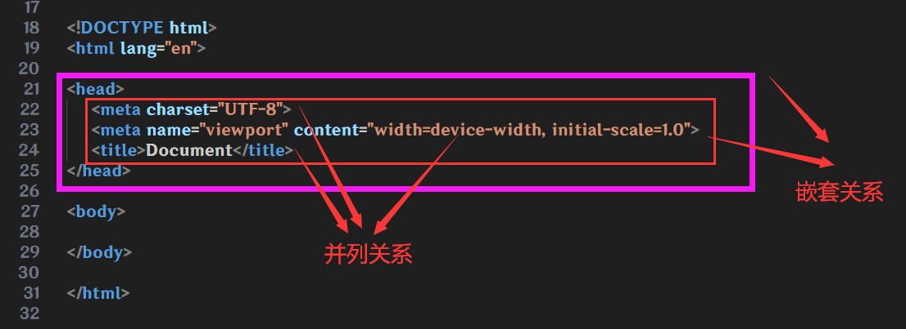
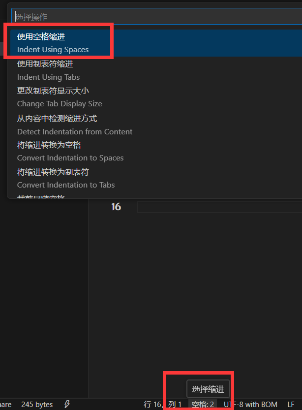

# 标签关系

作用:明确代码的书写关系

假设,一个箱子,里面放了一个苹果🍎和一个菠萝🍍

这时候,箱子和苹果或菠萝的关系就是**父子关系(嵌套关系)**,苹果和菠萝的关系就是**兄弟关系(并列关系)**

## 代码缩进

养成良好编码(编写代码)习惯,写代码嵌套关系要记得缩进,快捷键**Tab**,向后缩进一格,快捷键**Shift + Tab**,向前回退一个,VSCode中,默认一格为4个空格

点击**VSCode**右下角的选择缩进,在弹窗的选择框里,选择使用空格缩进,即可设置一格为多少个空格,一般4个就可以了

右键**VSCode**的编辑界面,在右键菜单找到**格式化文档**可以自动对齐(不要太依靠了,有时候对齐了更乱)
