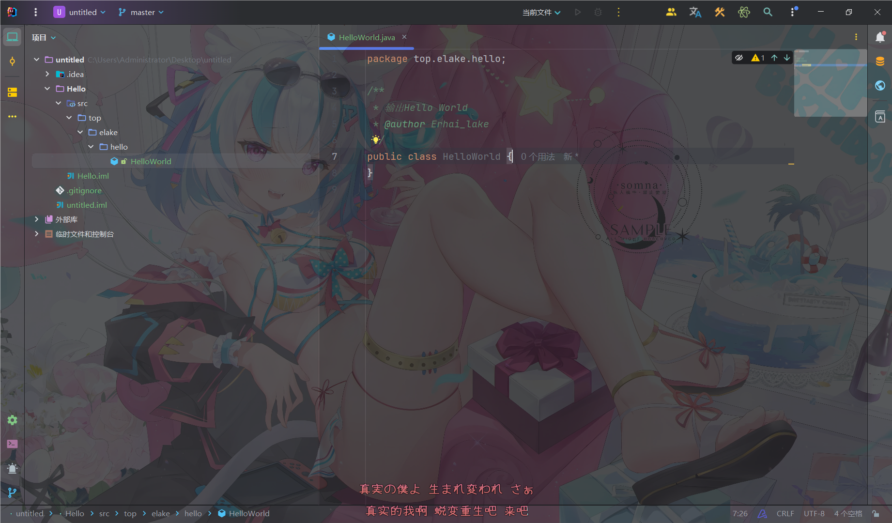
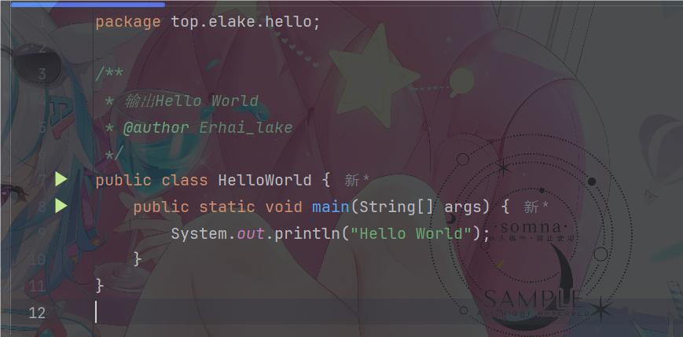

# 用IDEA写HelloWorld

用上一篇文档的方法,创建一个类



然后在`HelloWorld`类里面写下以下代码

```java showLineNumbers
public static void main(String[] args) {
    System.out.println("Hello World");
}
```



写完后点击顶部的绿色三角形,运行


等待程序构建完成后,就可以在弹出的运行窗口中看见`Hello World`了

:::tip
第一次运行可能会很慢,请耐心等待

Java项目编译时,编译速度和可编译项目的大小,取决于你电脑的CPU和RAM

人话:如果编译时很慢,或者编译大型项目时奔溃,那么你该升级你的电脑配置了
:::


## 代码解析

每个项目中,通常只有一个`main`入口点,入口点的代码为:

```java showLineNumbers
public static void main(String[] args) {
}
```

1. `public`: 访问修饰符
2. `static`: 关键词
3. `void`: 返回类型,`void`的意思就是空,入口点的目的是启动程序,不会有返回结果
4. `main`: 方法名
5. `String[] args`: 参数列表

剩下的`System.out.println("Hello World");`就是输出语句了

:::warning
在Java没断代码的结尾都要加`;`
:::
