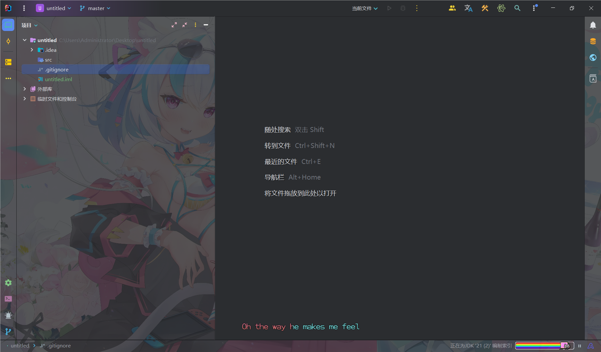
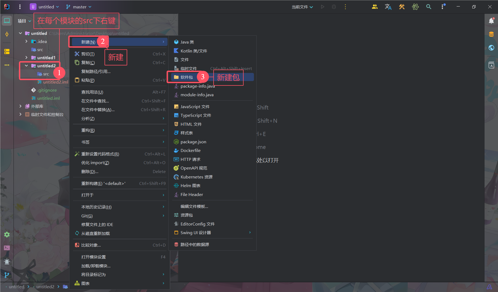
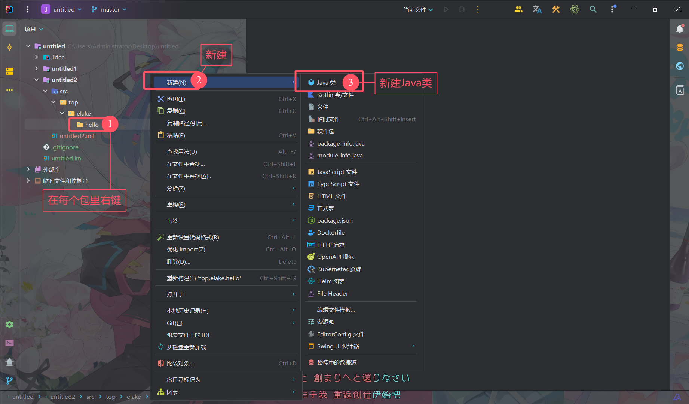
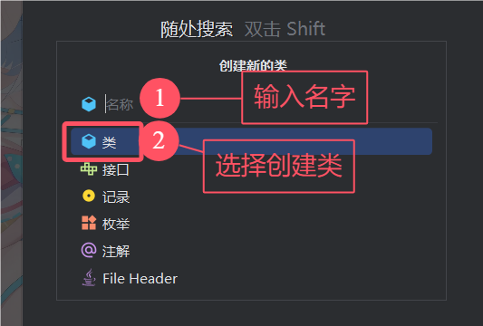

# Java项目的代码结构

```mermaid
flowchart TD; A["project(工程)"] --> B["moduke(模块)"] --> C["package(包)"] --> D["class(类)"]
```

我来举个例子,比如说我要写个B站

* B站系统(project)
    * 首页(moduke)
        * 用户界面(package)
            * 主页(class)
            * 视频播放器(class)
            * 搜索栏(class)
        * 数据服务(package)
            * 视频服务(class)
            * 用户服务(class)
    * 个人主页(moduke)
        * 用户界面(package)
            * 个人资料页面(class)
            * 关注列表(class)
        * 数据服务(package)
            * 简介服务(class)
            * 会计服务(class)
    * 推荐(moduke)
        * 个性化推荐(package)
            * 推荐算法(class)
            * 内容筛选器(class)
        * 用户界面(package)
            * 推荐列表(class)
            * 建议栏(class)

差不多就是这个样子,将不同的功能分开

## 在IDEA创建project

这样一个全新的项目就诞生了

## 在IDEA创建moduke

这样一个新的模块就诞生了

## 在IDEA创建package

:::warning
包名不是单单一个名字这么简单,一般是倒过来的公司域名和技术名,全部小写,例如:

`top.elake.hello`
:::

输入完后回车

:::tip
如果你的包不是像我这个的,而是这样的

可以按着下面的方法设置,看个人喜好

:::

这样一个新的包就诞生了

## 在IDEA创建class

输入完名称后回车

这样一个新的类就诞生了
