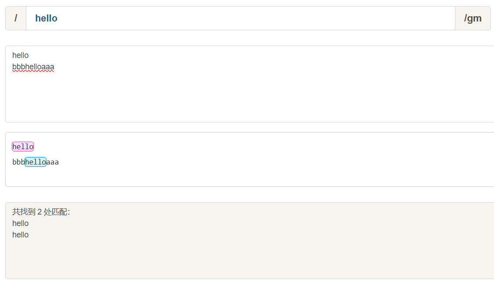
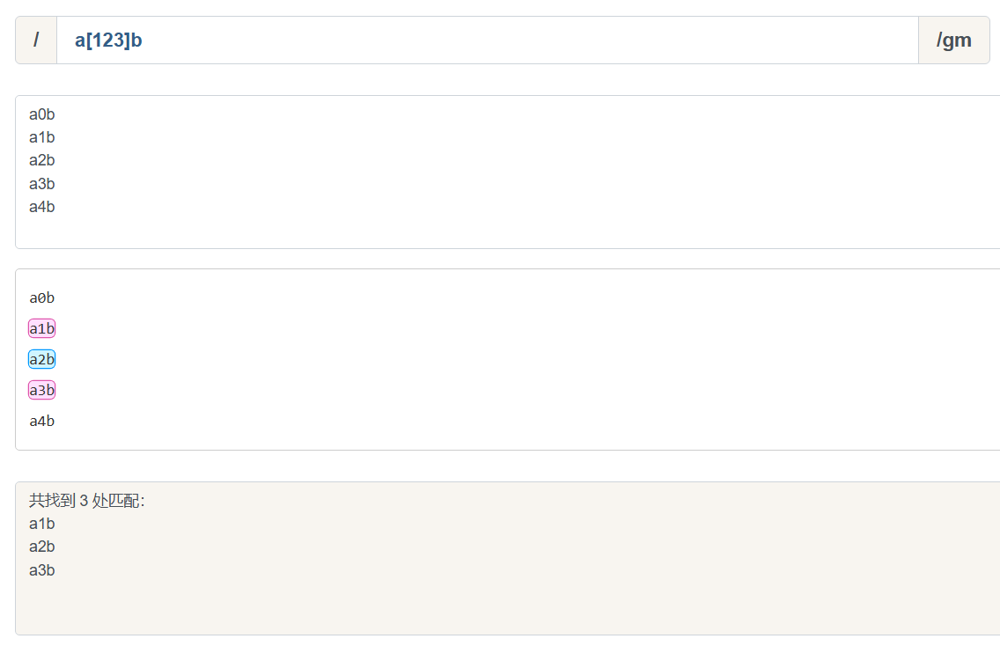
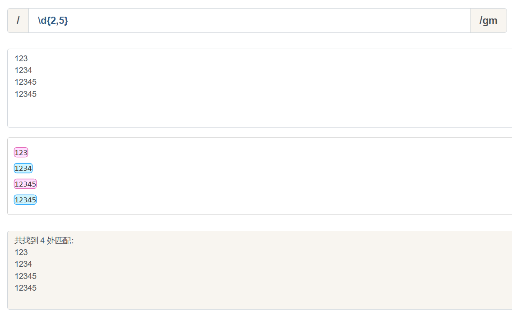
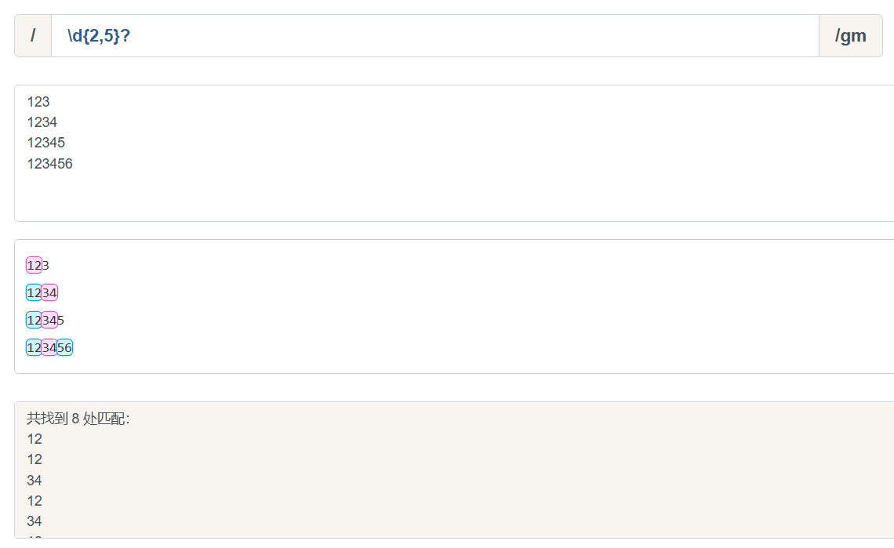
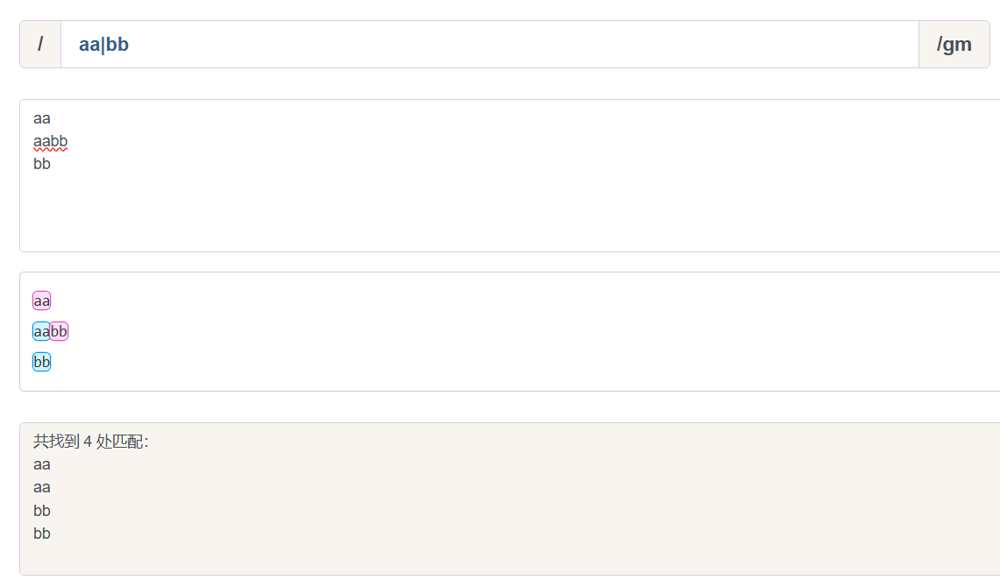
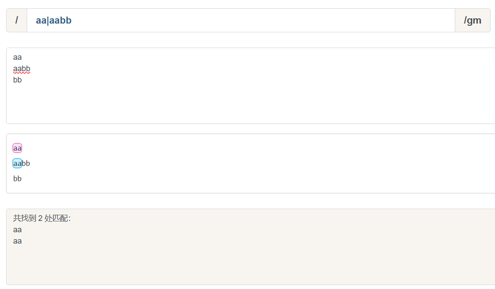
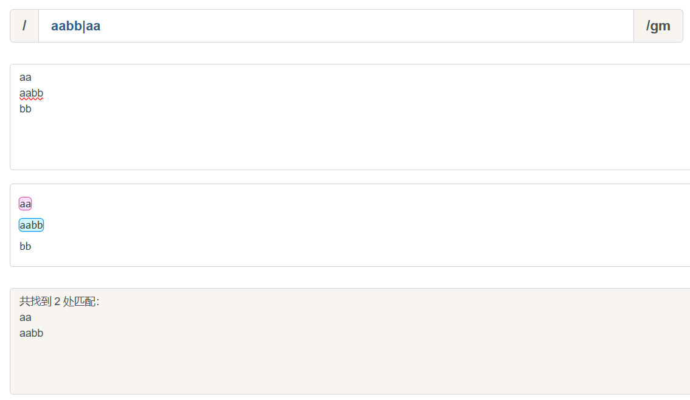

# 模糊匹配

如果正则只有精确匹配是没多大意义的,比如`/hello/`,也只能匹配字符串中的`hello`这个字符串

正则表达式之所以强大,是因为其能实现模糊匹配

而模糊匹配,有两个方向上的模糊: 横向模糊和纵向模糊

## 横向模糊匹配

个正则可匹配的字符串的长度不是固定的,可以有多种可能

其实现的方式是使用量词.例如`{m,n}`,表示连续出现最少m次,最多n次

## 纵向模糊匹配

一个正则匹配的字符串,具体到某一位字符时,它可以不是某个确定的字符,可以有多种可能

其实现的方式是使用字符组.例如`[abc]`,表示该字符是可以字符`a`,`b`,`c`中的任何一个

## 量词

量词也称重复.掌握`{m,n}`的准确含义后,只需要记住一些简写形式

### 常见的简写形式

* `{m,}` 表示至少出现`m`次
* `{m}`就是`{m,m}`.表示出现`m`次
* `?`就是`{0,1}`.表示出现或者不出现

+ `+`就是`{1,}`.表示出现至少一次
+ `*` 就是`{0,}`.表示出现任意次,有可能不出现

### 贪婪匹配

`/\d{2,5}/`表示数字连续出现2到5次.会匹配2位,3位,4位,5位连续数字

但是其实贪婪的,它会尽可能多的匹配.你能给我6个,我就要6个.你能给我3个,我就3要个.反正只要在能力范围内,越多越好

我们知道有时贪婪不是一件好事.

### 惰性匹配

而惰性匹配,就是尽可能少的匹配

`/\d{2,5}?/`表示虽然2到5次都行,当2个就够的时候,就不在往下尝试了

## 字符组

虽叫字符组(字符类),但只是其中一个字符.例如`[abc]`,表示该字符是可以字符`a`,`b`,`c`中的任何一个

### 范围表示法

如果字符组里的字符特别多的话怎么办?可以使用范围表示法

比如`[123456abcdefGHIJKLM]`,可以写成`[1-6a-fG-M]`.用连字符`-`来省略和简写

因为连字符有特殊用途,那么要匹配`a`,`-`,`z`这三者中任意一个字符,该怎么做呢?

不能写成`[a-z]`,因为其表示小写字符中的任何一个字符

可以写成如下的方式:`[-az]`或`[az-]`或`[a\-z]`

即要么放在开头,要么放在结尾,要么转义.总之不会让引擎认为是范围表示法就行了

### 排除字符组

纵向模糊匹配,还有一种情形就是,某位字符可以是任何东西,但就不能是`a`,`b`,`c`

此时就是排除字符组(反义字符组)的概念.例如`[^abc]`,表示是一个除`a`,`b`,`c`之外的任意一个字符.字符组的第一位放`^`(脱字符),表示求反的概念

当然,也有相应的范围表示法

### 常见的简写形式

有了字符组的概念后,一些常见的符号我们也就理解了,因为它们都是系统自带的简写形式

* `\d`就是`[0-9]`.表示是一位数字
* `\D`就是`[^0-9]`.表示除数字外的任意字符
* `\w`就是`[0-9a-zA-Z_]`.表示数字,大小写字母和下划线
* `\W`就是`[^0-9a-zA-Z_]`.非单词字符
* `\s`就是`[ \t\v\n\r\f]`.表示空白符,包括空格,水平制表符,垂直制表符,换行符,回车符,换页符
* `\S`就是`[^ \t\v\n\r\f]`. 非空白符
* `.`就是`[^\n\r\u2028\u2029]`.通配符,表示几乎任意字符.换行符,回车符,行分隔符和段分隔符除外

## 多选分支

一个模式可以实现横向和纵向模糊匹配,而多选分支可以支持多个子模式任选其一

具体形式如下:`(p1|p2|p3)`,其中`p1`,`p2`,`p3`是子模式，,用`|`(管道符)分隔,表示其中任何之一

例如要匹配`aa`和`bb`可以使用`/aa|bb/`

但有个事实我们应该注意,比如我用`/aa|aabb/`,去匹配`aabb`字符串时,结果是`aa`

而把正则改成`/aabb|aa/`后

也就是说,分支结构也是惰性的,即当前面的匹配上了,后面的就不再尝试了
