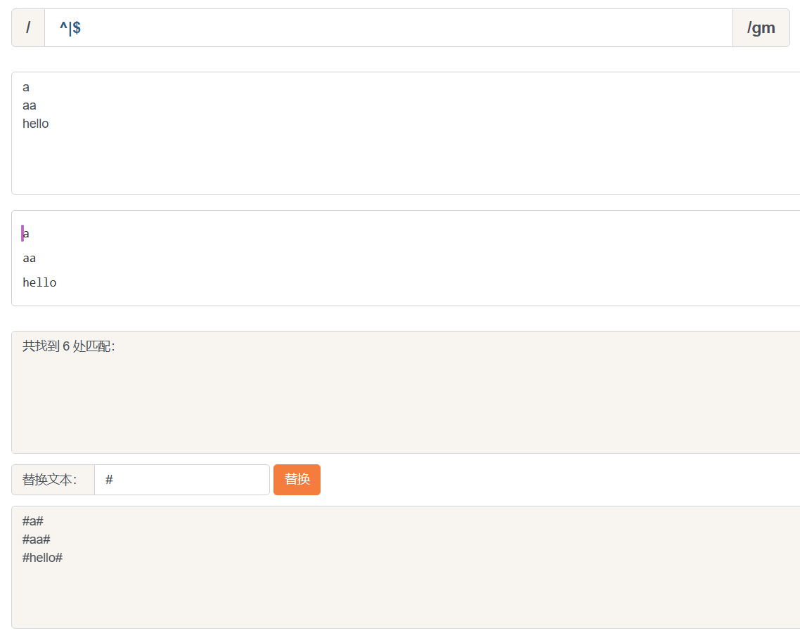
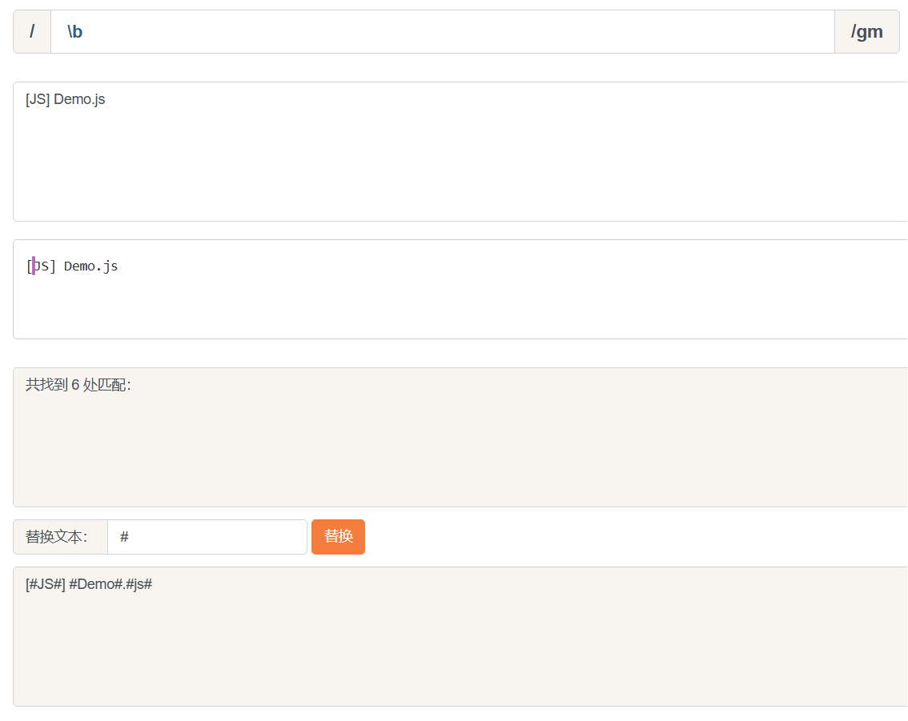
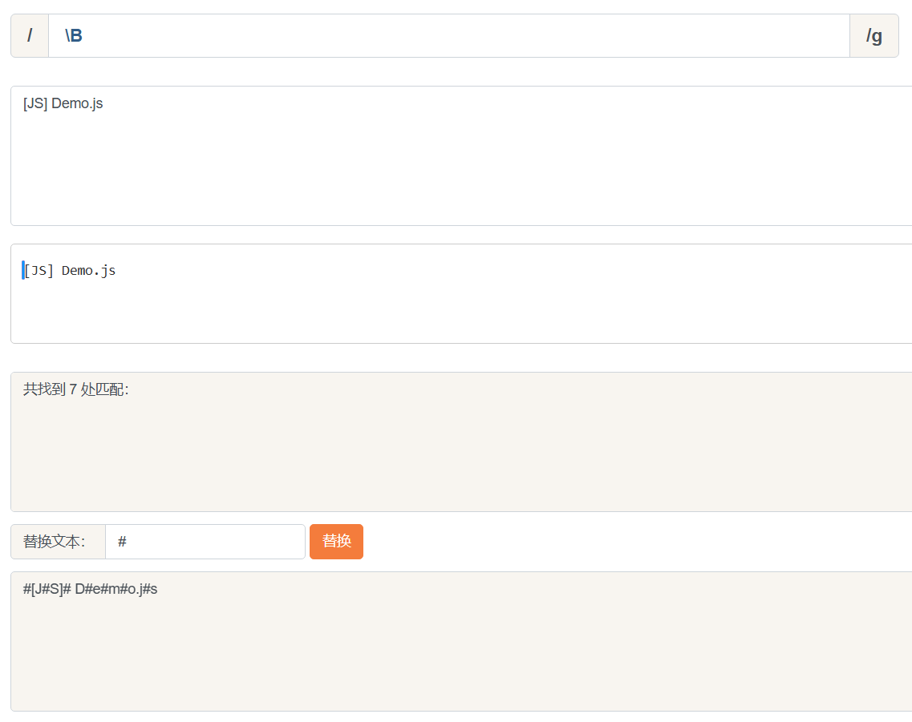
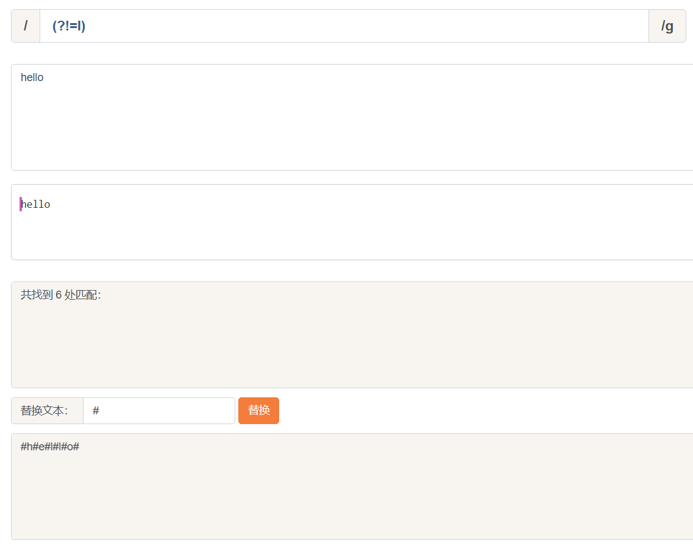

# 位置匹配

:::note
再次强调,正则表达式是匹配模式,要么匹配字符,要么匹配位置.请记住这句话

然而大部分人学习正则时,对于匹配位置的重视程度没有那么高
:::

## 什么是位置

位置是相邻字符之间的位置.例如,下图中箭头所指的地方

## 如何匹配位置

共有6个锚字符

`^`,`$`,`\b`,`\B`,`(?=p)`,`(?!p)`

### 前两个

`^`(脱字符)匹配开头,在多行匹配中匹配行开头

`$`(美元符号)匹配结尾,在多行匹配中匹配行结尾

### 中间两个

`\b`是单词边界,具体就是`\w`和`\W`之间的位置,也包括`\w`和`^`之间的位置,也包括`\w`和`$`之间的位置

比如一个文件名是`[JS] Demo.js`中的`\b`

为什么是这样呢?仔细看看呢~

首先,我们知道,`\w`是字符组`[0-9a-zA-Z_]`的简写形式,即`\w`是字母数字或者下划线的中任何一个字符.而`\W`是排除字符组`[^0-9a-zA-Z_]`的简写形式,即`\W`是`\w`以外的任何一个字符

此时我们可以看看`[#JS#] #Demo#.#js#`中的每一个`#`是怎么来的

* 第一个`#`,两边是`[`与`J`,是`\W`和`\w`之间的位置
* 第二个`#`,两边是`S`与`]`,也就是`\w`和`\W`之间的位置
* 第三个`#`,两边是空格与`D`,也就是`\W`和`\w`之间的位置
* 第四个`#`,两边是`o`与`.`,也就是`\w`和`\W`之间的位置
* 第五个`#`,两边是`.`与`j`,也就是`\W`和`\w`之间的位置
* 第六个`#`,其对应的位置是结尾,但其前面的字符`s`是`\w`,即`\w`和`$`之间的位置

知道了`\b`的概念后,那么`\B`也就相对好理解了

`\B`就是`\b`的反面的意思.非单词边界/例如在字符串中所有位置中.扣掉`\b`.剩下的都是`\B`的

具体说来就是`\w`与`\w`,`\W`与`\W`,`^`与`\W`,`\W`与`$`之间的位置

比如上面的例子,把所有`\B`替换成`#`

### 后两个

`(?=p)`,其中`p`是一个子模式,即`p`前面的位置

比如`(?=l)`,表示`l`字符前面的位置,例如

而`(?!p)`就是`(?=p)`的反面意思

## 位置的特性

对于位置的理解,我们可以理解成空字符` ""`

比如`"hello"`字符串等价于如下的形式

`"hello" == "" + "h" + "" + "e" + "" + "l" + "" + "l" + "o" + "";`

也就是

`"hello" == "" + "" + "hello"`

因此,把`/^hello$/`写成`/^^hello?$/`,是没有任何问题的

:::note
如果你想写屎山代码,甚至可以写成更复杂

`/(?=he)^^he(?=\w)llo$\b\b$/`

:::

也就是说字符之间的位置,可以写成多个

把位置理解空字符,是对位置非常有效的理解方式
