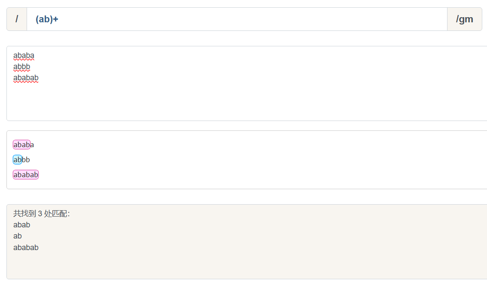
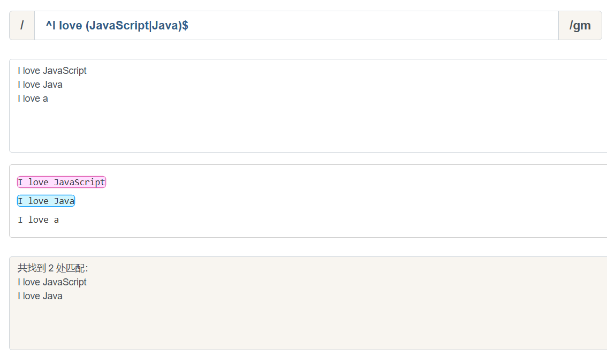
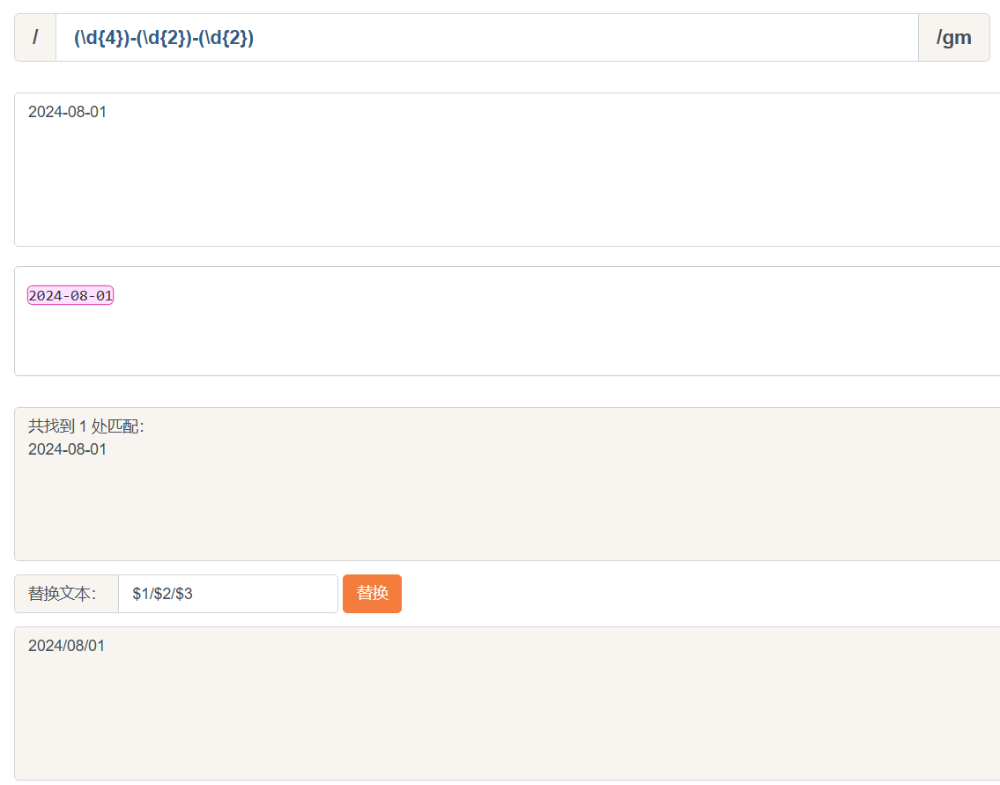
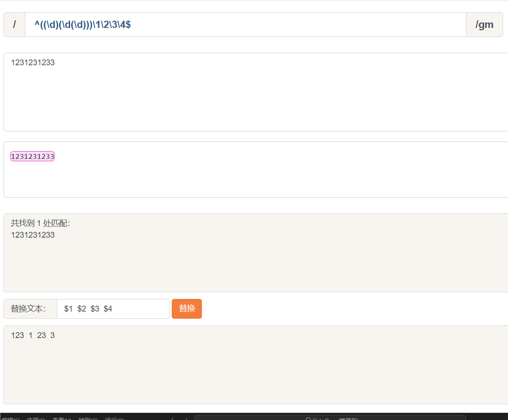
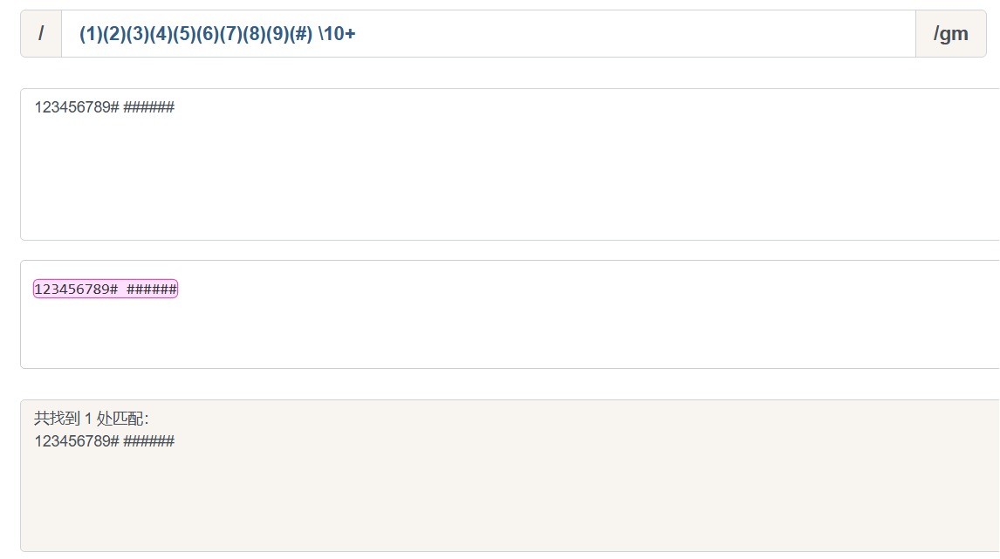

# 括号的作用

不管哪门语言中都有括号.正则表达式也是一门语言,而括号的存在使这门语言更为强大

对括号的使用是否得心应手,是衡量对正则的掌握水平的一个侧面标准

括号的作用,其实三言两语就能说明白,括号提供了分组,便于我们引用它

引用某个分组,会有两种情形:在JavaScript里引用它,在正则表达式里引用它

本章内容虽相对简单,但我也要写长点

## 分组

我们知道`/a+/`匹配连续出现的`a`,而要匹配连续出现的`ab`时,需要使用`/(ab)+/`

其中括号是提供分组功能,使量词`+`作用于`ab`这个整体

## 分支结构

而在多选分支结构`(p1|p2)`中,此处括号的作用也是不言而喻的,提供了子表达式的所有可能

比如,要匹配如下的字符串

`I love JavaScript`

`I love Java`

如果去掉正则中的括号,即`/^I love JavaScript|Java$/`,匹配字符串是`I love JavaScript`和`Java`,当然这不是我们想要的

## 引用分组

这是括号一个重要的作用,有了它,我们就可以进行数据提取,以及更强大的替换操作

而要使用它带来的好处,必须配合使用实现环境的API

以日期为例.假设格式是yyyy-mm-dd的,我们可以先写一个简单的正则

`/\d{4}-\d{2}-\d{2}/`然后再修改成括号版的`/(\d{4})-(\d{2})-(\d{2})/`

这时,就可以通过`$1`,`$2`,`$3`来提取数据了

## 反向引用

除了使用相应`API`来引用分组,也可以在正则本身里引用分组.但只能引用之前出现的分组,即反向引用

还是以日期为例

`2024-08-01`

`2024/08/01`

`2024.08.01`

`2024-08/01`

最先可能想到的正则是`/\d{4}(-|\/|\.)\d{2}(-|\/|\.)\d{2}/`

其中`/`和`.`需要转义.虽然匹配了要求的情况,但也匹配`2024-08/01`这样的数据

假设我们想要求分割符前后一致怎么办?此时需要使用反向引用

`/\d{4}(-|\/|\.)\d{2}\1\d{2}/`

注意里面的`\1`,表示的引用之前的那个分组`(-|\/|\.)`.不管它匹配到什么(比如`-`),`\1`都匹配那个同样的具体某个字符

我们知道了`\1`的含义后,那么`\2`和`\3`的概念也就理解了,即分别指代第二个和第三个分组

看到这里,此时,恐怕你会有三个问题

### 括号嵌套怎么办?

以左括号(开括号)为准

`/^((\d)(\d(\d)))\1\2\3\4$/`

我们可以看看这个正则匹配模式

* 第一个字符是数字,比如说`1`
* 第二个字符是数字,比如说`2`
* 第三个字符是数字,比如说`3`
* 接下来的是`\1`,是第一个分组内容,那么看第一个开括号对应的分组是什么,是`123`
* 接下来的是`\2`,找到第2个开括号,对应的分组,匹配的内容是`1`
* 接下来的是`\3`,找到第3个开括号,对应的分组,匹配的内容是`23`
* 最后的是`\4`,找到第3个开括号,对应的分组,匹配的内容是`3`

这个问题,估计仔细看一下,就该明白了

### \10表示什么呢

另外一个疑问可能是,即`\10`是表示第10个分组,还是`\1`和`0`呢?

答案是前者,虽然一个正则里出现`\10`比较罕见

`/(1)(2)(3)(4)(5)(6)(7)(8)(9)(#) \10+/`

### 引用不存在的分组会怎样?

因为反向引用,是引用前面的分组,但我们在正则里引用了不存在的分组时,此时正则不会报错,只是匹配反向引用的字符本身.例如`\2`,就匹配`\2`

:::warning
`\2`表示对`2`进行了转意
:::

## 非捕获分组

之前文中出现的分组,都会捕获它们匹配到的数据,以便后续引用,因此也称他们是捕获型分组

如果只想要括号最原始的功能,但不会引用它.就是既不在API里引用.也不在正则里反向引用

此时可以使用非捕获分组`(?:p)`,例如本文第一个例子可以修改为

`/(?:ab)+/g`
