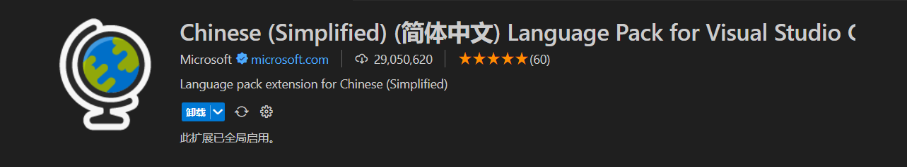

## 浏览器

推荐使用==Chrome==, ==Edge==.

教程中使用==Edge==.

==Edge==是微软开发的, Win10及以上系统自带的浏览器.

[官网地址](https://www.microsoft.com/zh-cn/edge)

## 编辑器

推荐使用==WebStorm(WS)==或者==Visual Studio Code(VS Code)==.

### WebStorm

==WebStorm==是由JetBrains开发的集成开发环境(IDE). 

它提供了强大的代码编辑功能, 调试工具, 版本控制集成等.

安装很简单, 不需要教吧...

记得关联文件资源管理器就可以了.

[官网地址](https://www.jetbrains.com/webstorm/)

软件默认安装了中文插件, 不需要额外安装.

如果没有在插件列表里搜索.

```markdown
Chinese (Simplified) Language Pack / 中文语言包
```

### VS Code

==VS Code==是由微软开发的免费开源的代码编辑器(我更喜欢归为文本编辑器).

它支持多种编程语言, 拥有丰富的扩展生态系统, 并且几乎全平台.

安装很简单, 不需要教吧...

记得关联文件资源管理器就可以了.

[官网地址](https://code.visualstudio.com/)

### 插件

点击侧边栏的插件(Ctrl + Shift + X). 

VS Code推荐安装这两个插件.

##### 中文汉化

```markdown
Chinese (Simplified) (简体中文) Language Pack for Visual Studio Code
```



用于汉化VS Code.

##### 内网服务器

```markdown
Live Server
```


这个插件可以创建一个内网, 用于实时更新网页代码等.

在`.html`或者`.htm`后缀的文件, 右键鼠标, 可以看见右键菜单里, 多了两项.


Open with Live Server 是启动服务器并打开网页.

Stop Live Server 就是关闭了.

正常来说, 打开网页后, 浏览器会自动跳转, 没有自动跳转也没关系, 在浏览器输入内网网址也可以, 默认为`http://localhost:5500`.

5500是端口号, 在VS Code右下角可以看见, 点击这个也可以关闭或打开网页.


