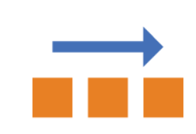
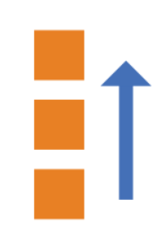
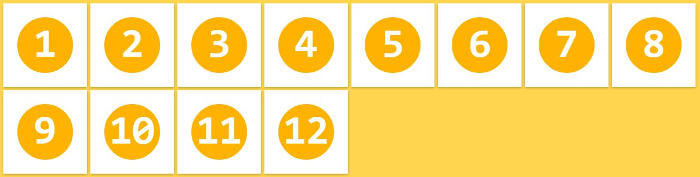
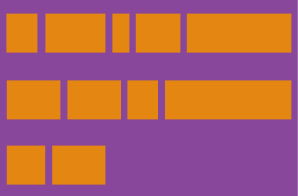

Flex布局是==浏览器提倡==的布局模型, 非常使用结构化布局, 提供强大的==空间布局==和==对齐==能力.

Flex模型==不会==产生浮动布局中的==脱标==现象, 布局网页==更简单, 更灵活==

Flex模型有6个属性:

* `flex-direction`.
* `flex-wrap`.
* `flex-flow`.
* `justify-content`.
* `align-items`.
* `align-content`.

项目也有6个属性:

* `order`.
* `flex-grow`.
* `flex-shrink`.
* `flex-basis`.
* `flex`.
* `align-self`.

## 基本概念

采用`Flex`布局的元素, 称为Flex容器(flex container), 简称==容器==.

它的所有子元素自动成为容器成员, 称为Flex项目(flex item), 简称==项目==.


容器默认存在两根轴:==水平的主轴(main axis)==和==垂直的交叉轴(cross axis)==.

主轴的开始位置(与边框的交叉点)叫做main start, 结束位置叫做main end.

交叉轴的开始位置叫做cross start, 结束位置叫做cross end.

项目默认沿主轴排列.

单个项目占据的主轴空间叫做main size, 占据的交叉轴空间叫做cross size.

## flex-direction 属性

`flex-direction`属性决定主轴的方向(即项目的排列方向).

属性值:

`row`: 主轴为==水平方向==, 起点在==左端==(默认值).



`row-reverse`: 主轴为==水平方向==, 起点在==右端==.


`column`: 主轴为==垂直方向==, 起点在==上沿==.


`column-reverse`: 主轴为==垂直方向==, 起点在==下沿==.



## flex-wrap 属性

默认情况下, 项目都排在一条线(轴线)上.

`flex-wrap`属性定义, 如果一条轴线排不下, 如何换行.

属性值:

`nowrap`: 不换行(默认值).


`wrap`: 换行, 第一行在==上方==.



`wrap-reverse`: 换行, 第一行在==下方==.


## flex-flow 属性

`flex-flow`属性是`flex-direction`属性和`flex-wrap`属性的简写形式.

默认值为: `row nowrap`.

## justify-content 属性

`justify-content`属性定义了项目在主轴上的对齐方式.

属性值:

`flex-start`: 左对齐(默认值).


`flex-end`: 右对齐.


`center`: 居中.


`space-between`: 两端对齐, 项目之间的间隔都相等.


`space-around`: 每个项目两侧的间隔相等. 所以, 项目之间的间隔比项目与边框的间隔大一倍.


`space-evenly`: 均匀排列每个元素, 每个元素之间的间隔相等.


## align-items 属性

`align-items`属性定义项目在交叉轴上如何对齐.

属性值:

`flex-start`: 交叉轴的起点对齐.


`flex-end`: 交叉轴的终点对齐.


`center`: 交叉轴的中点对齐.


`baseline`: 项目的第一行文字的基线对齐.


`stretch`: 如果项目未设置高度或设为auto, 将占满整个容器的高度(默认值).


## align-content 属性

`align-content`属性定义了多根轴线的对齐方式. 如果项目只有一根轴线, 该属性不起作用.

属性值:

`flex-start`: 与交叉轴的起点对齐.


`flex-end`: 与交叉轴的终点对齐.


`center`: 与交叉轴的中点对齐.


`space-between`: 与交叉轴两端对齐, 轴线之间的间隔平均分布.


`space-around`: 每根轴线两侧的间隔都相等. 所以, 轴线之间的间隔比轴线与边框的间隔大一倍.



`stretch`: 轴线占满整个交叉轴(默认值).


## order 属性

`order`属性定义项目的排列顺序. 数值越小, 排列越靠前, 默认为0.


## flex-grow 属性

`flex-grow`属性定义项目的放大比例, 默认为0, 即如果存在剩余空间, 也不放大.

如果所有项目的`flex-grow`属性都为1, 则它们将等分剩余空间(如果有的话). 如果一个项目的`flex-grow`属性为2, 其他项目都为1, 则前者占据的剩余空间将比其他项多一倍.


## flex-shrink 属性

`flex-shrink`属性定义了项目的缩小比例, 默认为1, 即如果空间不足, 该项目将缩小.

如果所有项目的`flex-shrink`属性都为1, 当空间不足时, 都将等比例缩小. 如果一个项目的`flex-shrink`属性为0, 其他项目都为1, 则空间不足时, 前者不缩小.

负值对该属性无效.


## flex-basis 属性

`flex-basis`属性定义了在分配多余空间之前, 项目占据的主轴空间(main size). 浏览器根据这个属性, 计算主轴是否有多余空间. 它的默认值为auto, 即项目的本来大小.

它可以设为跟width或height属性一样的值, 则项目将占据固定空间.

## flex 属性

`flex`属性是`flex-grow`, `flex-shrink`和`flex-basis`的简写, 默认值为0 1 auto. 后两个属性可选.

该属性有两个快捷值: `auto`(1 1 auto)和`none`(0 0 auto).

建议优先使用这个属性, 而不是单独写三个分离的属性, 因为浏览器会推算相关值.

## align-self 属性

`align-self`属性允许单个项目有与其他项目不一样的对齐方式, 可覆盖`align-items`属性. 默认值为`auto`, 表示继承父元素的`align-items`属性, 如果没有父元素, 则等同于`stretch`.

该属性可能取6个值, 除了`auto`, 其他都与`align-items`属性完全一致.


## 例子

::::demo

:::code-tabs
@tab:active HTML
```html
<div class="box">
    <div>1</div>
    <div>2</div>
    <div>3</div>
    <div>4</div>
</div>
```

@tab CSS
```css
.box {
    width: 100%;
    padding: 20px;
    background-color: pink;
    display: flex;
    justify-content: space-around;
}

.box div{
    width: 100px;
    height: 100px;
    background-color: yellow;
}
```
:::

::::

## 布局生成器

老规矩, 发几个生成器的网址.

[Flex在线工具](https://jack.jackafan.top/zsd/css/flex/) ☆

[Flexible Box Display](https://kexiaolong.gitee.io/flexible-box-display/)
