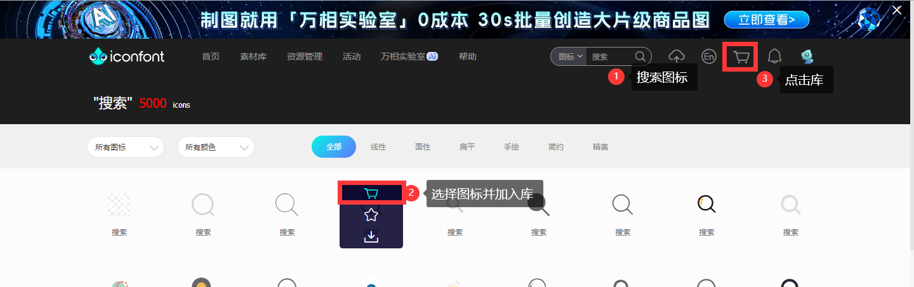
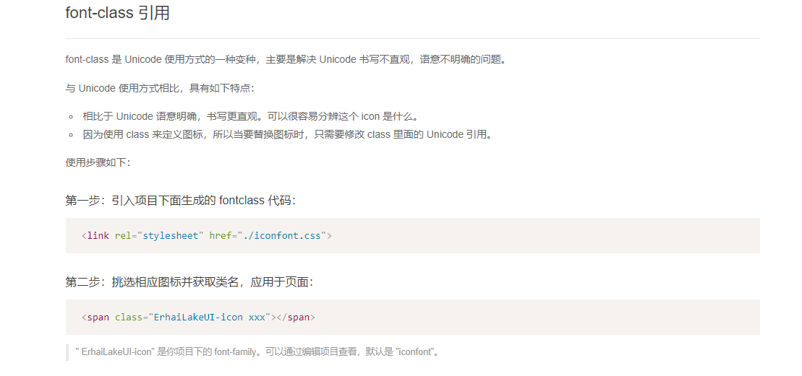

展示的是==图标==, 本质是==字体==.

作用: 在网页中添加简单地, 颜色单一的小图标.

优点:

* 灵活性: 灵活的修改样式, 例如:尺寸, 颜色等.
* 轻量性: 体积小, 渲染快, 降低服务器请求次数.
* 兼容性: 几乎兼容所有主流浏览器.
* 使用方便: 先下载再使用.

国内可以使用阿里的[iconfont图标库](https://www.iconfont.cn).

可以直接下载图标源文件, 或者添加至项目, 合并成字体图标.






推荐使用Font class方法, Vue.js推荐使用Symbol方法, 根据教程使用即可.

引入项目下面生成的fontclass代码.

```html
<link rel="stylesheet" href="iconfont.css">
```

挑选相应图标并获取类名, 应用于页面.

```html
<span class="ErhaiLakeUI-icon xxx"></span>
```

## 上传自定义图标

只能上传SVG的矢量图.


在确认编辑页面点击去除颜色提交后, 等待审核通过后即可.


