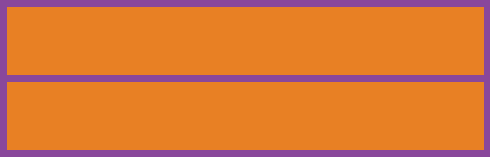
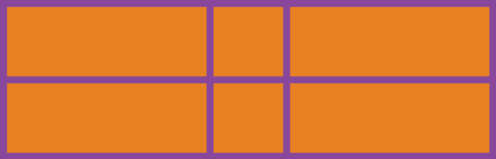

使用flex布局的痛点:

如果使用`justify-content: space-between;`让子元素两端对齐, 自动分配中间间距, 假设一行4个, 如果每一行都是4的倍数那没任何问题, 但如果最后一行是2, 3个的时候就会出现下面的状况:

::::demo

:::code-tabs
@tab:active HTML
```html
<div class="box">
	<div></div>
	<div></div>
	<div></div>
	<div></div>
	<div></div>
	<div></div>
	<div></div>
	<div></div>
	<div></div>
	<div></div>
	<div></div>
	<div></div>
	<div></div>
	<div></div>
</div>
```

@tab CSS
```css
.box {
	padding: 20px 0;
	background-color: #89479B;
	display: flex;
	justify-content: space-between;
	flex-wrap: wrap;
}

.box div{
	margin: 20px;
	width: 100px;
	height: 100px;
	background-color: #E88024;
}
```
:::

::::

如果想让最后一行左对齐也是有办法的, 能实现但是操作起来有些麻烦, 但是如果这种布局使用grid布局的话, 就会变的非常容易.

::::demo

:::code-tabs
@tab:active HTML
```html
<div class="box">
	<div></div>
	<div></div>
	<div></div>
	<div></div>
	<div></div>
	<div></div>
	<div></div>
	<div></div>
	<div></div>
	<div></div>
	<div></div>
	<div></div>
	<div></div>
	<div></div>
</div>
```

@tab CSS
```css
.box {
	padding: 20px;
	background-color: #89479B;
	display: grid;
	grid-template-columns: repeat(5, 1fr);
	gap: 20px;
}

.box div{
	width: 100px;
	height: 100px;
	background-color: #E88024;
}
```
:::

::::

`display: grid`: 是转为栅格布局, 这个是必须的.

`grid-template-columns: repeat(5, 1fr)`: 将网格分为几列, `repeat`是重复, 循环, `1fr`是自适配单位.

`gap: 20px`: 栅格项之间的间隔.

看, 上面的grid布局, 最后一行不是5的倍数, 但是可以左对齐, 不会有像flex布局一样的特性.

## grid-template-columns 属性

`grid-template-columns: 1fr;`: 独占一行.



`grid-template-columns: 1fr 1fr;`: 一行分为两列.


`grid-template-columns: 1fr 200px 1fr;`: 中间固定200px, 两边自动平均分配.



`grid-template-columns: 1fr 1fr 1fr 1fr 1fr;`: 如果多列的值相同, 可以使用repeat()函数.

`grid-template-columns: repeat(5,1fr)`当然将1fr缓存固定的px尺寸也可以.


`grid-template-columns: repeat(auto-fill, minmax(255px, 1fr));`: 这种写法可以用来做响应式布局, `auto-fill`主轴上指定的宽度或者重复次数是最大可能的正整数, `minmax`最小值`255px`, `minmax`最大值`1fr`代表剩余空间的比例.

:::warning
要实现这种响应式布局, 父容器不能使用固定宽度, 可以将父容器改为如:`80%`, 这样就能根据屏幕的宽度, 自动展示一行展示几个了.
:::


## grid-row和grid-column属性

可以控制某个元素占领几份.

以grid-row行为例, 从第几列开始 / 第几列+想占几个.

```css
grid-row: 1/3;
grid-column: 1/3;
```


