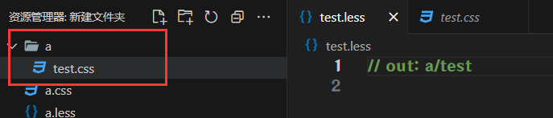

## 简介

Less是一个==CSS预处理器==, Less文件后缀是`.less`.

扩充了CSS语言, 使CSS具备一定的逻辑性, 计算能力.

:::warning
浏览器不识别Less代码, 目前阶段, 网页要引入对应的CSS文件.
:::

VSCode插件:`Easy LESS`, 保存Less文件后, ==自动==生成对应的==CSS文件==.

例子:

:::code-tabs
@tab:active LESS
```less
.a {
    color: red;
    width: (68 / 37.5rem);

    .b {
        height: (29/37.5rem);
    }
}
```

@tab CSS
```css
.a {
    color: red;
    width: 1.81333333rem;
}
.a .b {
    height: 0.77333333rem;
}
```
:::

## 注释

单行注释: `// 注释`.

块注释: `/* 注释 */`.

## 运算

==加减乘==直接书写计算表达式即可.

==除法==需要添加括号或`.`.

:::code-tabs
@tab:active LESS
```less
.box {
	width: 100 + 50px;
	height: 5 * 20px;

	width: (100 / 4px);
	height: 100 ./ 4px;
}
```

@tab CSS
```css
.box {
	width: 150px;
	height: 100px;

	width: 25px;
	height: 25px;
}
```
:::

## 嵌套

快速生成==后代==选择器.

`&`: 表示当前选择器.

:::code-tabs
@tab:active LESS
```less
.父级选择器 {
	color: red;

	a {
		color: green;

		&:hover {
			color: blue;
		}
	}
}
```

@tab CSS
```css
.父级选择器 {
	color: red;
}
.父级选择器 a {
	color: green;
}
.父级选择器 a:hover {
	color: blue;
}
```
:::

## 变量

定义变量: `@变量名: 数据`.

使用变量: `@变量名`.

:::code-tabs
@tab:active LESS
```less
.box {
	@test: 114514;
	width: @test;

	.box2 {
		width: @test;
	}
}
```

@tab CSS
```css
.box {
	width: 114514;
}
.box .box2 {
	width: 114514;
}
```
:::

## 导入

导入 Less 公共样式文件.

语法: `@import "文件路径"`.

提示: 如果是Less文件, 可以省略后缀.

```less
@import "a";
```

a.less:

:::code-tabs
@tab:active LESS
```less
.box{
	width: 100px;
}
```

@tab CSS
```css
.box {
	width: 100px;
}
```
:::

## 导出

在 Less 文件的==第一行==添加`// out: 存储路径`.


