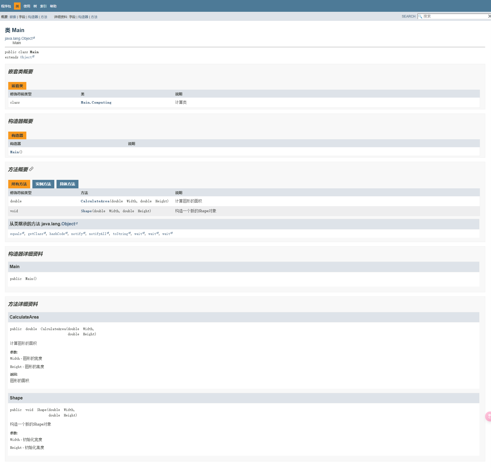

注释是写在程序中对代码进行解释说明的文字, 方便自己和其他人查看, 以便理解程序的.

## 单行注释

```java
// 注释
```

在`//`右边的一整行文字会被忽略.

## 多行注释

```java
/*
    注释
*/
```

在`/*`和`*/`之间的文本会被忽略.

## 文档注释

```java
/**
 *  注释
 */
```

文档注释是一种特殊类型的注释, 它不仅为代码提供解释, 而且可以被工具(如Javadoc)用来生成外部HTML文档.

### 类注释

类注释位于类定义之前, 描述类的功能和用法.

```java
/**
 * 计算类
 */
public class Computing {
    // 类的实现
}
```

### 方法注释

方法注释位于方法定义之前, 描述方法的功能, 参数, 返回值以及可能抛出的异常.

```java
/**
 * 计算图形的面积
 *
 * @param Width  图形的宽度
 * @param Height 图形的高度
 * @return 图形的面积
 */
public double CalculateArea(double Width, double Height) {
    return Width * Height;
}
```

### 字段注释

字段注释位于字段定义之前, 描述字段的含义和用途.

```java
/**
 * 图形的宽度
 */
private double Width;

/**
 * 图形的高度
 */
private double Height;
```

### 构造器注释

构造器注释位于构造器定义之前, 描述构造器的用法和参数.

```java
/**
 * 构造一个新的Shape对象
 *
 * @param Width  初始化宽度
 * @param Height 初始化高度
 */
public void Shape(double Width, double Height) {
    this.Width = Width;
    this.Height = Height;
}
```

### 通用注释标签

以下是一些常用的**Javadoc**注释标签:

* `@author`: 标识类的作者.
* `@version`: 标识类的版本.
* `@since`: 标识引入该API的版本.
* `@param`: 描述方法的参数.
* `@return`: 描述方法的返回值.
* `@throws`或`@exception`: 描述方法可能抛出的异常.
* `@deprecated`: 标识该API已过时, 并推荐替代方案.

### 生成文档

要生成文档, 可以使用IDEA的生成工具.


生成完后, 用浏览器打开, 应该能看见这样的页面.


