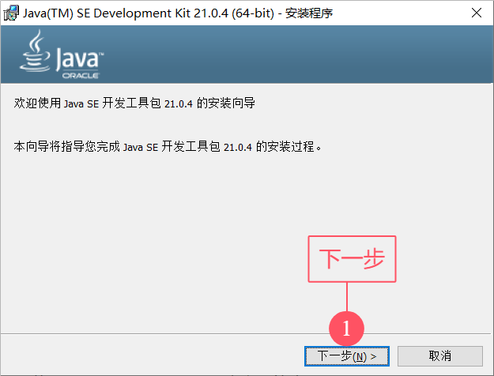
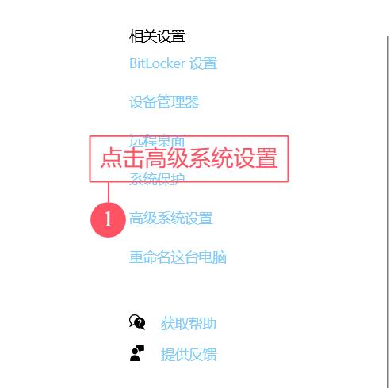
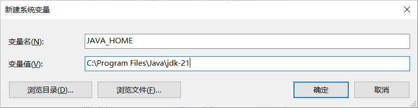

## JDK

Java的产品叫**JDK(Java Development Kit - Java开发者工具包)**, JDK是编写Java程序的必须品.

## JDK的发展史

* **JDK 1.0**.
    * 1996-01.
    * 这是JDK的第一个版本.
* **J2SE 5.0**.
    * 2004-09.
    * 原名为**J2SE 1.5**.
    * 里程碑版本.
* **Java SE 8**.
    * 2014-03.
    * 长期支持版本(LTS).
* **JDK 11**.
    * 2018-09.
    * 长期支持版本(LTS).
* **JDK 17**.
    * 2021-09.
    * 长期支持版本(LTS).
* **JDK 21**.
    * 2023-09.
    * 长期支持版本(LTS).

这里是一些JDK较为重要的版本, 很多公司依然在使用JDK8, 因为他足够稳定, 并且更换的成本也高.

:::warning
这篇文档用JDK21继续教学.
:::

## JDK 的下载

技术人员的专业软件一定要会自己下载安装, 不然容易被同事~~鄙视~~

JDK的官方下载地址在这里: [点我跳转](https://www.oracle.com/cn/java/technologies/downloads)

下载JDK的长期支持版本就好了.

如果你没有找到你想要的版本, 可以查看[历史版本](https://www.oracle.com/cn/java/technologies/downloads/archive)

下载时可能需要注册并登录网站.


## JDK 的安装

以下为保姆级图片教程.





快捷键`Win + R`打开运行, 输入`cmd`打开cmd窗口, 输入.

```shell
java -version
javac -version
```

显示以下内容即, 安装完成.

```shell
$ java -version
java version "21.0.4" 2024-07-16 LTS
Java(TM) SE Runtime Environment (build 21.0.4+8-LTS-274)
Java HotSpot(TM) 64-Bit Server VM (build 21.0.4+8-LTS-274, mixed mode, sharing)
```

```shell
$ javac -version
javac 21.0.4
```

如果报错: `java不是内部或外部命令...`.

那就是环境变量没配置, 接着往下看.

## 配置环境变量

:::warning
从JDK17开始, 安装完成后, 环境变量会自动配置.

如果显示`java不是内部或外部命令...`那就继续看.
:::





输入以下内容.

```markdown
JAVA_HOME
```

```markdown
JDK安装时的绝对路径
```



在系统变量的列表里找到`CLASSPATH`.

如果没有, 和刚刚一样点击新建.

输入以下内容.

```markdown
CLASSPATH
```

```markdown
.;%JAVA_HOME%\lib\dt.jar;%JAVA_HOME%\lib\tools.jar;
```


在系统变量的列表里找到`Path`.

这个不可能没有的了.

输入以下内容.

```markdown
%JAVA_HOME%\bin
```

```markdown
%JAVA_HOME%\jre\bin
```


快捷键`Win + R`打开运行, 输入`cmd`打开cmd窗口, 输入.

```shell
java -version
javac -version

```

显示以下内容即, 安装完成.

```shell
$ java -version
java version "21.0.4" 2024-07-16 LTS
Java(TM) SE Runtime Environment (build 21.0.4+8-LTS-274)
Java HotSpot(TM) 64-Bit Server VM (build 21.0.4+8-LTS-274, mixed mode, sharing)
```

```shell
$ javac -version
javac 21.0.4
```

## java和javac

`java.exe`是执行工具.

`javac.exe`是编译工具.

我们写好的Java代码是高级语言, 计算机底层是硬件, 并不能识别只些语言, 必须先通过`javac.exe`编译工具进行翻译, 然后在用`java.exe`执行工具执行, 才可以驱动计算机干活.

## JDK 的组成

* **JVN(Java Virtual Machine)**: Java虚拟机, 真正运行Java程序的地方.
* **核心类库**: Java提供的程序接口, 给程序员自己的程序调用的.
* **JRE(Java Runtime Environment)**: Java的运行环境.

除了这3个东西, 还有**Javac(编译工具)**, **Jdb(调试器)**等, 共同组成了JDK.
