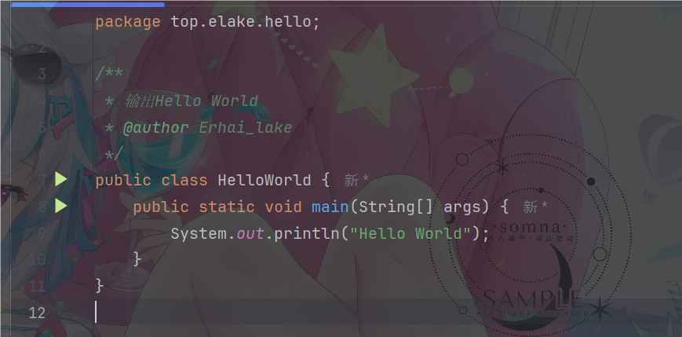

用上一篇文档的方法, 创建一个类.


然后在`HelloWorld`类里面写下以下代码.

```java
public static void main(String[] args) {
    System.out.println("Hello World");
}
```



写完后点击顶部的绿色三角形, 运行.


等待程序构建完成后, 就可以在弹出的运行窗口中看见`Hello World`了.

:::tip
第一次运行可能会很慢, 请耐心等待.

Java项目编译时, 编译速度和可编译项目的大小, 取决于你电脑的CPU和RAM.

人话:如果编译时很慢, 或者编译大型项目时崩溃, 那么你该升级你的电脑配置了.
:::


## 代码解析

每个项目中, 通常只有一个`main`入口点, 入口点的代码为:

```java
public static void main(String[] args) {
}
```

1. `public`: 访问修饰符.
2. `static`: 关键词.
3. `void`: 返回类型, `void`的意思就是空, 入口点的目的是启动程序, 不会有返回结果.
4. `main`: 方法名.
5. `String[] args`: 参数列表.

剩下的`System.out.println("Hello World");`就是输出语句了.

:::warning
在Java没断代码的结尾都要加`;`.
:::
