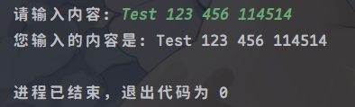

* 输入: 程序通过标准输入读取数据. 通过Java提供的**Scanner**类来实现. 例如: `Scanner scanner = new Scanner(System.in);`.
* 输出: 程序通过标准输出打印数据. 通过Java提供的**System.out**类来实现. 例如: `System.out.println("Hello, World!");`.

**Scanner**是Java提供的一个用于获取输入的类. 通过它可以方便地读取用户输入的数据.

::: tip
**API(Application Programming Interface: 应用程序编程接口)**

* Java写好的类库和接口, 供开发者调用和使用.
* 通过API, 开发者可以方便地实现各种功能, 而无需关心底层实现细节.

[下载 Java API 文档](https://www.oracle.com/java/technologies/javase-jdk21-doc-downloads.html)
:::

输出很简单, 这里最主要的是输入.

## 输入

1. 导包: 告诉编译器使用Scanner类, 在代码的最上方添加以下代码: `import java.util.Scanner;`.
2. 创建Scanner对象: 使用Scanner类的构造方法创建一个Scanner对象, 代码如下: `Scanner scanner = new Scanner(System.in);`.
3. 读取输入: 使用Scanner对象的nextLine()方法读取一行输入, 代码如下: `String input = scanner.nextLine();`.
4. 关闭Scanner: 使用完Scanner对象后, 应该调用其close()方法关闭它, 代码如下: `scanner.close();`.
5. 处理输入: 对读取到的输入进行处理, 例如: `System.out.println("您输入的内容是: " + input);`.

### 完整例子

```java
import java.util.Scanner;

public class Main {
    public static void main(String[] args) {
        // 创建Scanner对象
        Scanner scanner = new Scanner(System.in);

        // 读取输入
        System.out.print("请输入内容: ");
        String input = scanner.nextLine();

        // 关闭Scanner
        scanner.close();

        // 处理输入
        System.out.println("您输入的内容是: " + input);
    }
}
```



### 小技巧

在IDEA中, 通常不需要手动导包, 当你敲下`Scanner scanner = new Scanner(System.in);`时, IDE会自动为你导入所需的包.

如果没有, 可以通过鼠标悬浮在`Scanner`上, 然后使用快捷键`Alt + Enter`来快速导入缺失的包.
