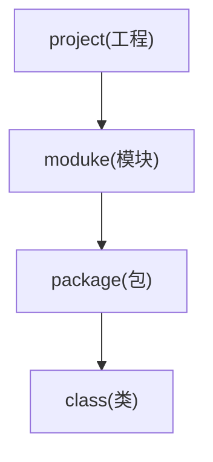
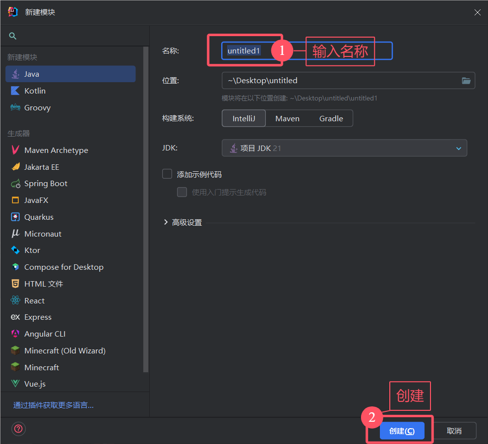

我来举个例子, 比如说我要写个B站.

* B站系统(project).
    * 首页(moduke).
        * 用户界面(package).
            * 主页(class).
            * 视频播放器(class).
            * 搜索栏(class).
        * 数据服务(package).
            * 视频服务(class).
            * 用户服务(class).
    * 个人主页(moduke).
        * 用户界面(package).
            * 个人资料页面(class).
            * 关注列表(class).
        * 数据服务(package).
            * 简介服务(class).
            * 会计服务(class).
    * 推荐(moduke).
        * 个性化推荐(package).
            * 推荐算法(class).
            * 内容筛选器(class).
        * 用户界面(package).
            * 推荐列表(class).
            * 建议栏(class).

差不多就是这个样子, 将不同的功能分开.

## 在 IDEA 创建 project

这样一个全新的项目就诞生了.

## 在 IDEA 创建 moduke

这样一个新的模块就诞生了.

## 在 IDEA 创建 package

:::warning
包名不是单单一个名字这么简单, 一般是倒过来的公司域名和技术名, 全部小写, 例如:

`top.elake.hello`
:::

输入完后回车.

:::tip
如果你的包不是像我这个的, 而是这样的.

可以按着下面的方法设置, 看个人喜好.

:::

这样一个新的包就诞生了.

## 在 IDEA 创建 class

输入完名称后回车.

这样一个新的类就诞生了.
