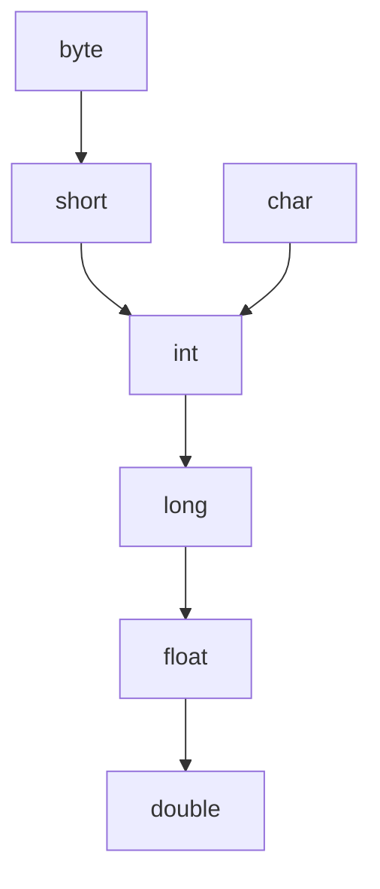
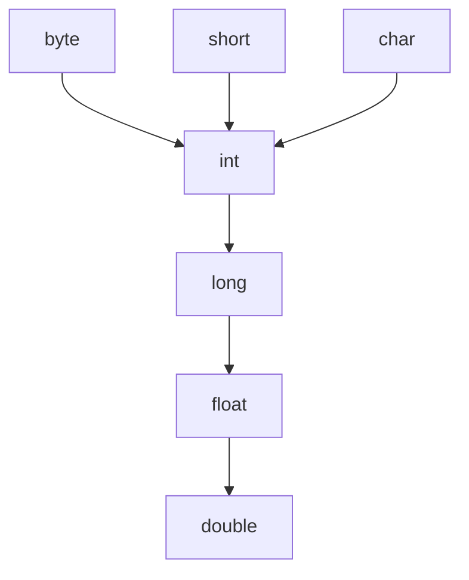

## 自动类型转换

**类型范围小**的变量, 可以**直接赋值**给**类型范围大的**变量, 但反之则不行.

比如`byte`可以直接赋值给`int`, 但`int`不能直接赋值给`byte`, 因为`int`的范围比`byte`大.



### 例子

```java
public class Test {
    public static void main(String[] args) {
        byte a = 12;
        test(a);
    }

    public static void test(int a) {
        System.out.println(a);
    }
}
```

如果反过来.

```java
public class Test {
    public static void main(String[] args) {
        int a = 12;
        test(a);
    }

    public static void test(byte a) {
        System.out.println(a);
    }
}
```

报错: `java: 不兼容的类型: 从int转换到byte可能会有损失`.

### 执行原理

* `byte`是8位, `int`是32位, `int`的范围比`byte`大, 所以可以直接赋值.
* `int`是32位, `byte`是8位, `int`的范围比`byte`大, 不能直接赋值.
* `int`的范围是-2147483648到2147483647, `byte`的范围是-128到127, 所以不能直接赋值.
* `byte`的范围小于`int`的范围, 因此在赋值时需要进行类型转换.
* `int`的范围大于`byte`的范围, 因此在赋值时不需要进行类型转换.

## 强制类型转换

**类型范围大的**变量, 可以**强制转换**为**类型范围小的**变量, 但反之则不行.

### 例子

```java
public class Test {
    public static void main(String[] args) {
        int a = 12;
        test((byte) a);
    }

    public static void test(byte a) {
        System.out.println(a);
    }
}
```

这个例子中, 方法会打印出`12`, 因为`int`的值在`byte`的范围内.

但是如果我们将`int`的值改为`128`, 就会打印出`-128`, 因为`byte`的范围是-128到127, 所以会发生溢出.

::: warning
强制类型转换**会导致数据溢出(丢失)**, 需要谨慎使用!

浮点型强转成整数型, 会直接丢失小数部分.
:::

## 表达式的自动类型提升

::: tip
什么是表达式: 表达式是由操作数和运算符组成的, 例如`a + b`, `a * b`, `a / b`等.
:::

在表达式中, 小范围类型的变量, 会自动转换成表达式中较大范围的类型, 再进行计算.



::: warning
* 表达式的最终结果类型由表达式中的**最高类型决定**.
* **在表达式中, `byte`, `short`, `char`** 是 **直接转换成`int`** 类型参与运算的.
:::
