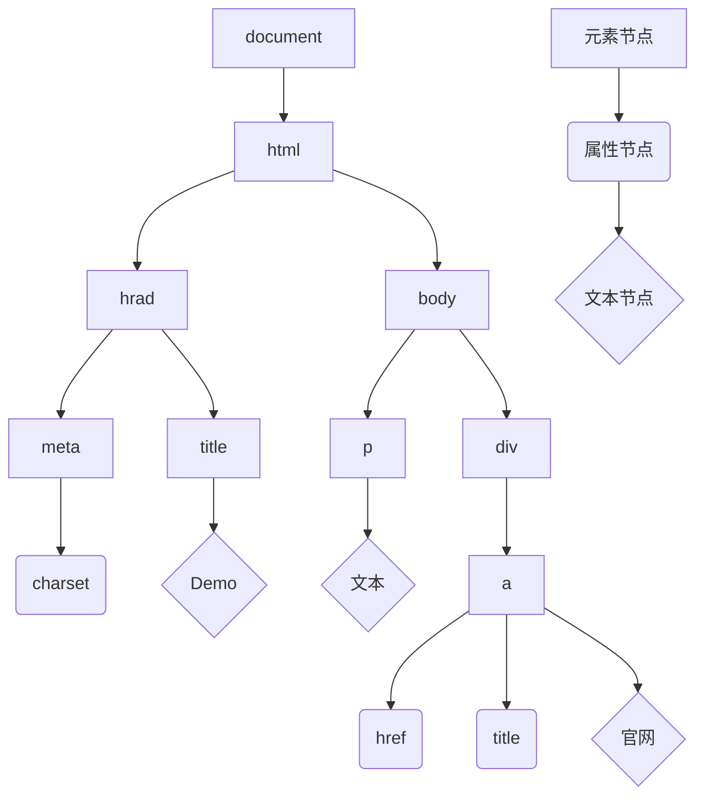

## 作用和分类

就是通过JS调用WebAPI, 去操作网页和浏览器.

WebAPI分两大类.

==DOM==: 文档对象模型.

==BOM==: 浏览器对象模型(用于操作浏览器的.例如弹窗, 控制台输出等).

## DOM

### DOM 是什么

DOM(Document Object Model ==文档对象模型==)是用来呈现以及与任意==Html==或==XML==文档交互的API.

用通俗易懂的话来说, DOM是浏览器提供的一套专门用来==操作网页内容==的功能.

作用: 开发页面内容特效和实现用户交互.

### DOM 树是什么

将页面文档以树结构直观的表现出来, 我们称之为文档树或DOM树.

DOM树直观的体现了标签与标签之间的关系.

举个例子:

```html
<!DOCTYPE html>
<html lang="zh_CN">

<head>
    <meta charset="UTF-8">
    <meta name="viewport" content="width=device-width, initial-scale=1.0">
    <title>Demo</title>
</head>

<body>
    <p>文本</p>
    <div>
        <a href="www.elake.top" title="点我">官网</a>
    </div>
</body>

</html>
```



### DOM对象(重要)

DOM对象: 浏览器根据html便签生成的==JS对象==.

* 所有的标签属性都可以在这个对象上面找到.
* 修改这个对象的属性会自动映射到标签身上.

举个例子:

```html
<!DOCTYPE html>
<html lang="zh_CN">

<head>
    <meta charset="UTF-8">
    <meta name="viewport" content="width=device-width, initial-scale=1.0">
    <title>Demo</title>
</head>

<body>
    <div>Test</div>
    <script>
        const Div = document.querySelector("div")
        console.log(Div)
        console.log(typeof Div)
        // object
    </script>
</body>

</html>
```

展开在控制台输出的`Div`, 可以看见里面有很多的属性.


DOM的核心思想: 把网页内容当做==对象==来处理.

document对象.

* 是DOM里提供的一个==对象==.
* 所有他提供的属性和方法都是==用来访问和操作网页内容的==, 例如:`Document.write()`
* 网页所有内容都在`document`里面.
