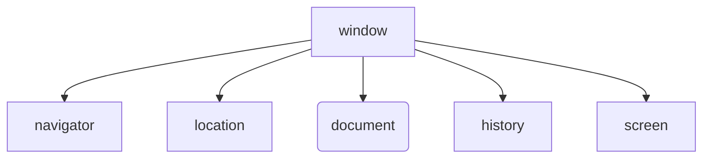

BOM(Browser Object Model)是浏览器对象模型.

window对象是一个全局对象, 也可以说是JavaScript中的顶级对象.

像`document`, `alert()`, `console.log()`这些都是window的属性, 基本BOM的属性和方法都是window的.

所有通过`var`定义在全局作用域中的变量, 函数都会变成window对象的属性和方法.

window对象下的属性和方法调用的时候可以省略window.

:::note
也就是说, `document.querySelector()`可以写成`window.document.querySelector()`是没人这么写.

就像别人问你, 你是哪里人, ==只要你还在中国境内==, 没人会说我是中国广东人的吧, 都是说我是广东人的.
:::
