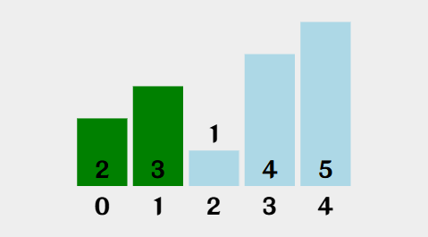
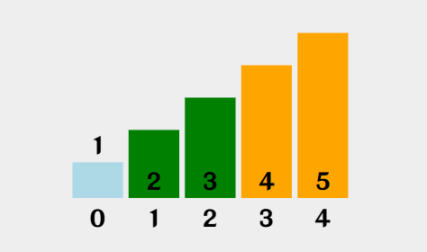

* 冒泡排序是一种简单的排序算法.
* 它重复地走访过要排序的数列, 一次比较两个元素, 如果他们的顺序错误就把他们交换过来.走访数列的工作是重复地进行直到没有再需要交换, 也就是说该数列已经排序完成.
* 这个算法的名字由来是因为越小的元素会经由交换慢慢“浮”到数列的顶端.
* 比如数组`[2, 3, 1, 4, 5]`经过排序成为了`[1, 2, 3, 4, 5]`或者`5, 4, 3, 2, 1`.

## 分析

[VisuAlgo](https://visualgo.net/zh/sorting)这个网站提供了多种排序的动画生成用于方便理解, 下方的图片来源就是这个网站.

### 初始


### 第一步

2不大于3, 跳过.



### 第二步

3大于1, 交换.


### 第三步

3不大于4, 跳过.


### 第四步

4不大于5, 跳过.


### 第五步

2大于1, 交换.


### 第六步

2不大于3, 跳过.


### 第七步

3不大于4, 跳过.


### 第八步

1不大于2, 跳过.


### 第九步

2不大于3, 跳过.




### 动画


## 代码

知道了原理, 就来写算法吧.

```javascript
let Arr = [10, 5, 6, 4, 8, 2, 1, 5, 9, 8, 5, 0, 2, 4, 6, 10, 8, 9, 5]
console.log(Arr)
let Max = Arr.length - 1
for (let I = 0; I < Max; I++) {
    let Done = true
    for (let J = 0; J < Max; J++) {
        if (Arr[J] > Arr[J + 1]) {
            let Temp = Arr[J]
            Arr[J] = Arr[J + 1]
            Arr[J + 1] = Temp
            Done = false
        }
    }
    if (Done) {
        break
    }
}
console.log(Arr)
```

