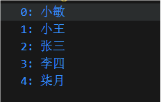

`forEach()`方法用于调用数组的每个元素, 并将元素传递给回调函数.

使用场景: 标题说了==遍历数组的每一个元素==.

```javascript
被遍历的数组.forEach(function (当前数组元素, 当前元素索引号) {
    // 函数体
})

// 箭头函数
被遍历的数组.forEach((当前数组元素, 当前元素索引号) => {
    // 函数体
})
```

:::warning
1. `forEach`只要是遍历数组.
2. 参数当前数组元素是必填的, 索引号可选.
:::

举个例子.

```javascript
const Test = ["小敏", "小王", "张三", "李四", "柒月"]
Test.forEach((Item, Index) => {
    console.log(`${Index}: ${Item}`)
})
```


