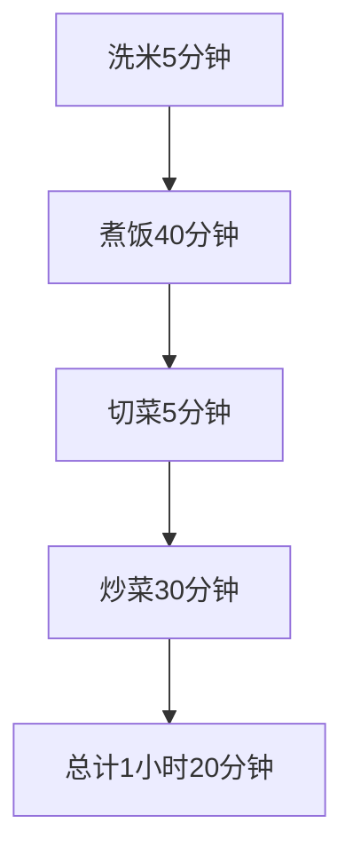
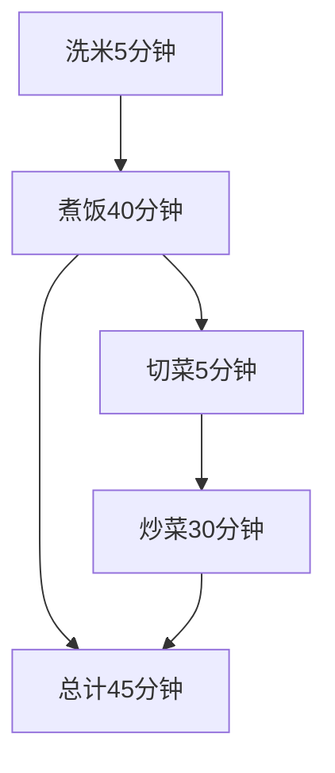
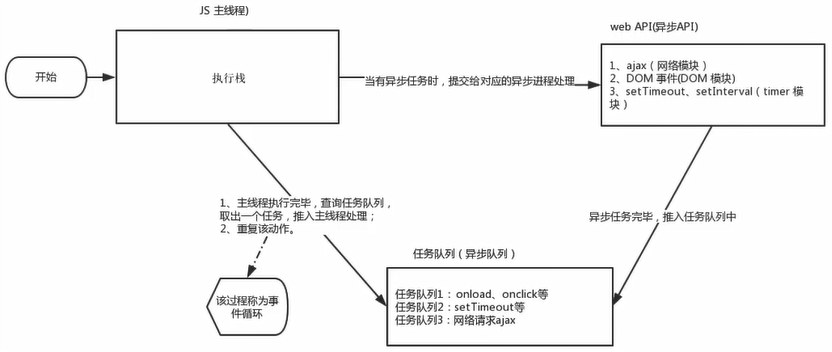

## 经典面试题

```javascript
console.log(1)
setTimeout(() => {
	console.log(2)
}, 1000)
console.log(3)
// 问:输出的顺序是什么
// 答1, 3, 2
```

延时了1秒钟, 所以是132, 合理.

```javascript
console.log(1)
setTimeout(() => {
    console.log(2)
}, 0)
console.log(3)
// 问:输出的顺序是什么
// 答1, 3, 2
```

为什么延时0秒, 不应该是立即执行么, 怎么还是132?

## 线程

JavaScript语言的一大特点就是==单线程==, 也就是说, ==同一时间只能做一件事==.

:::note
这是因为JavaScript这门脚本语言诞生的使命所致的.

JavaScript是为处理页面中用户的交互, 以及操作DOM而诞生的.比如我们对某个DOM元素进行添加和删除操作, 不能同时进行.应该先添加, 之后再删除.

单线程就意味着, 所有任务需要排队, 前一个任务结束, 才会执行后一个任务.这样所导致的问题是:

如果JS执行的时间过长, 就会造成页面渲染不连贯, 导致页面渲染加载堵塞感.

为了解决这个问题, 利用多核CPU的算力, Html5提出Web Worker标准, 运行JavaScript脚本创建多个线程.于是, JS中出现了==同步==和==异步==.
:::

### 同步

前一个任务结束后再执行后一个任务, 程序的执行顺序与任务的排队顺序是一致的, 同步的. 举个例子:

洗米花费5分钟, 煮饭花费40分钟, 饭熟了才去切菜花费5分钟, 炒菜花费30分钟, 一共花费了1个小时30分钟. 看不懂? 上图!



### 异步

你在做一件事情时, 因为这件事情会花费很长时间, 在做这件事的同时, 可以去处理其他事情. 举个例子:

洗米花费5分钟, 煮饭花费40小时, 饭还有35分钟熟的时候, 去切菜花费5分钟, 炒菜花费30分钟, 这时饭刚好熟了, 一共花费了45个小时. 看不懂? 上图!



### 本质

同步和异步本质就是执行顺序的不同.

### 同步任务

同步任务都是在主线程上执行, 形成一个==执行栈==

### 异步任务

JS 的异步是通过回调函数实现的.

一般而言, 异步任务有以下3种类型.

1. 普通事件, 如`click`, `resize`等.
2. 资源加载, 如`load`, `error`等.
3. 定时器, 包括`setInterval`, `setTimeout`等.

异步任务相关添加到==任务队列==中(任务队列也称为==消息队列==).

## 机制

1. 先执行==执行栈中的同步任务==.
   1. 输出`1`.
   2. 输出`3`.
2. 异步任务放入==任务队列==中.
   1. 记录`setTimeout(console.log(2),  0)`.
3. 一旦执行栈的所有同步任务执行完毕, 系统就会按次序读取==消息队列==中的异步任务, 于是被读取的异步任务结束等待状态, 进入执行栈, 开始执行.
   1. 输出`2`.

由于主线程不断的重复获取任务, 执行任务, 再获取任务, 再执行, 所以这种机制被称为==事件循环==(event loop).


