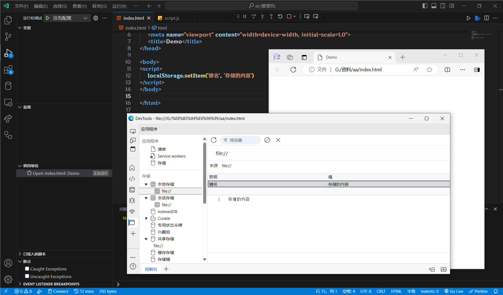

在是用来长期存储用户数据的存储方式, 可以理解成数据库.

数据是存储在==用户浏览器==中的.

设置, 读取方便, 页面刷新也不会导致数据丢失.

`sessionStorage`和`localStorage`的存储大小约有5MB左右.

## localStorage

可以永久将数据存储在本地, 除非手动删除.

特性:

* 同一浏览器, 同一域名下, 可以多窗口, 多页面共享.
* 以键值对的形式存储使用.

### 存储数据

`localStorage.setItrm(key,  value)`

```html
<script>
    localStorage.setItem("键名",  "存储的内容")
</script>
```

在控制台的应用程序里的本地存储就可以找到了, 这时不管怎么刷新, 都不会删除了.

:::warning
如果键名不存在, 就是新增数据, 如果存在, 就是修改数据.
:::



### 获取数据

```html
<script>
    console.log(localStorage.getItem("键名"))
    // 存储的内容
</script>
```

:::warning
如果读取不存在的数据, 会返回`null`.
:::

### 删除数据

```html
<script>
    localStorage.removeItem("键名")
</script>
```

## sessionStorage

特性:

* 生命周期为关闭浏览器窗口(关闭浏览器, 数据就会被清除).
* 在同一窗口, 页面下, 数据可以共享.
* 以键值对的形式存储使用.
* 用法跟`localStorage`基本相同.

在开发中, 一般不用这个.

## 存储复杂数据类型

本地存储只能存储字符串, 那要怎么存储复杂数据呢?

很简单, 只需要将复杂数据转换成Json字符串, 就可以存储了.

`JSON.stringify(复杂数据类型)`

`JSON.parse(Json字符串)`

```html
<script>
    const Obj = {
        Name: "张三",
        Age: 18,
        Gender: "男"
    }
    // 将对象转换为Json字符串后存储
    localStorage.setItem("obj", JSON.stringify(Obj))
    // 将Json字符串转换成对象输出
    console.log(JSON.parse(localStorage.getItem("obj")))
</script>
```

