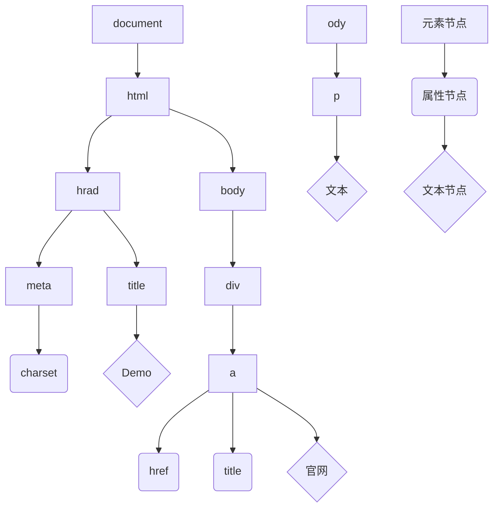
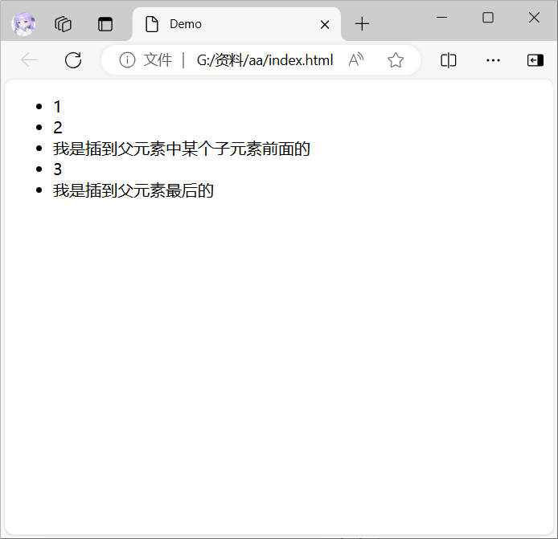
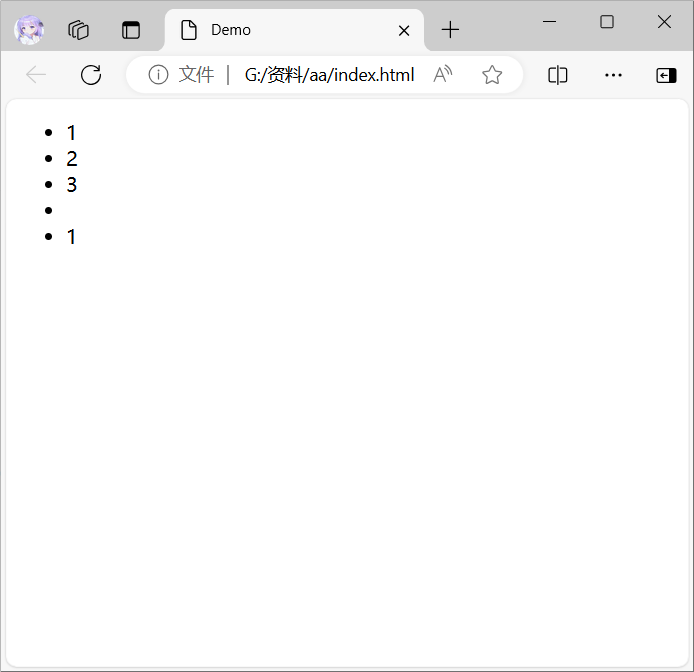

## DOM 节点

DOM 树里每一个内容都称为节点.

节点类型.

* 元素节点.
	* 所有的标签, 例如:`body`, `div`.
	* `html`是根节点.
* 属性节点.
	* 所有的属性, 例如`href`.
* 文本节点.
	* 所有的文本.
* 其他.



## 查找节点

### 父节点查找

`子元素.parentNode`

返回最近一级的父节点, 找不到返回`null`.

例如, 可以通过`p`元素获取上一级的`div`元素.

```html
<div><p></p></div>
<script>
	console.log(document.querySelector("p").parentNode)
</script>
```

### 子节点查找

`父节点.childNodes`**(了解)**.

获取所有==子节点==, 包括文本节点(空格, 换行), 注释节点等等.

`父节点.children`**(重点)**.

仅获取所有==子元素==.

返回一个伪数组.

例如, 可以通`ul`元素获取所有子元素.

```html
<ul>
	<li></li>
	<li></li>
	<li></li>
	<li></li>
	<li></li>
</ul>
<script>
	console.log(document.querySelector("ul").children)
</script>
```

### 兄弟关系查找

下一个兄弟节点.

`nextElementSibling`

上一个兄弟节点.

`previousElementSibling`

```html
<div>
	<p></p>
	<span></span>
	<i></i>
</div>
<script>
	// 下一个
	console.log(document.querySelector("span").nextElementSibling)
	// 返回i元素

	// 上一个
	console.log(document.querySelector("span").previousElementSibling)
	// 返回p元素
</script>
```

## 增加节点

新增节点一般分为两步.

1. 创建一个新的节点.
2. 把创建的新节点放到指定的元素内部.

### 创建节点

`document.createElement("标签名")`

### 追加节点

将创建的新节点插入元素里.

#### 插到父元素最后

`父元素.appendChild(要插入的元素)`

#### 插到父元素中某个子元素前面

`父元素.insertBefore(要插入的元素, 插到在哪个元素前面)`

```html
<ul>
	<li>1</li>
	<li>2</li>
	<li class="a">3</li>
</ul>
<script>
	// 创建元素
	const NEW1 = document.createElement("li")
	// 写点内容
	NEW1.textContent = "我是插到父元素最后的"
	// 插到父元素最后
	document.querySelector("ul").appendChild(NEW1)

	// 创建元素
	const NEW2 = document.createElement("li")
	// 写点内容
	NEW2.textContent = "我是插到父元素中某个子元素前面的"
	// 插到父元素中某个子元素前面
	document.querySelector("ul").insertBefore(NEW2, document.querySelector(".a"))
</script>
```



### 克隆节点

`元素.cloneNode(布尔值)`

如果传入`true`, 则代表克隆时会包含后代节点一起克隆.

如果传入`false`, 则代表克隆时不包含后代节点.

默认为`false`.

```html
<ul>
	<li>1</li>
	<li>2</li>
	<li>3</li>
</ul>
<script>
	const Ul = document.querySelector("ul")
	// 克隆元素
	const NEW1 = Ul.children[0].cloneNode()
	const NEW2 = Ul.children[0].cloneNode(true)
	// 插到父元素最后
	Ul.appendChild(NEW1)
	UL.appendChild(NEW2)
</script>
```



## 删除节点

`父元素.removeChild(要删除的元素)`

:::warning
如果不存在父子关系, 则无法删除.
:::

:::note
删除节点和隐藏节点(`display: none`)的区别.

隐藏节点虽然没有了, 但还是在html节点中的.

删除节点是直接从html节点中删除.
:::

```html
<ul>
	<li>1</li>
	<li>2</li>
	<li>3</li>
</ul>
<script>
	const Ul = document.querySelector("ul")
	// 删除节点
	Ul.removeChild(Ul.children[1])
</script>
```


