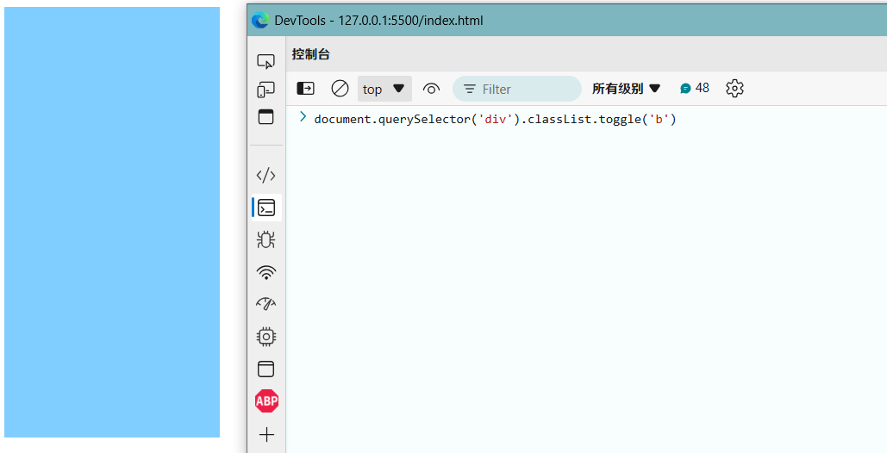

## 直接修改样式

除了操作元素内容和属性外, 还可以通过JS设置或修改标签元素的样式.

`对象.style.样式名 = ""`

:::demo
```html
<script>
	function modification() {
		const IMG = document.querySelector("img")
		IMG.style.height = "100px"
    }
</script>

<button onclick="modification()">修改样式</button>
```
:::

:::warning
CSS中, 像这样`background-color`的样式, 使用js修改需要写成这样`backgroundColor`(小驼峰命名法).

`对象.style.backgroundColor = ""`

用JS修改CSS样式和CSS是一样的, 都是要写单位的, 如果是修改背景图片之类的, 一样要写`url(xxx)`.
:::

## 修改 class

### `className`

上面是直接修改CSS样式的, 那如果我要修改的样式十分的多, 就不方便了.

所以我们可以使用`元素.className = "类名"`直接使用写在CSS表里的样式.

:::demo
```html
<style>
    .a {
        width: 200px;
        height: 200px;
        background-color: #000;
    }
    .b {
        width: 400px;
        height: 200px;
        background-color: #80ceff;
    }
</style>
<div class="a"></div>
<button onclick="modificationA()">修改为样式 a</button>
<button onclick="modificationB()">修改为样式 b</button>
<script>
	const DIV = document.querySelector("div")
	function modificationA() {
		DIV.className = "a"
	}
	function modificationB() {
		DIV.className = "b"
	}
</script>
```
:::

:::tip
`className`是替换, 不会保留原本的class, 如果只需要添加一个类, 需要保留之前的类名.

那有没有什么办法, 可以不使用`className`替换, 更方便的加入一个类, 删除一个类, 切换一个类呢?

往下看~
:::

### `classList`

:::demo
```html
<style>
    .a {
        width: 200px;
        height: 200px;
        background-color: #000;
    }
    .b {
        width: 400px;
        height: 200px;
        background-color: #80ceff;
    }
</style>
<div class="a"></div>
<button onclick="modificationA()">修改为样式 a</button>
<button onclick="modificationB()">修改为样式 b</button>
<script>
	const DIV = document.querySelector("div")
	function modificationA() {
		// 先删除b类, 再加入a类
		DIV.classList.remove("b")
		DIV.classList.add("a")
    }
	function modificationB() {
		// 先删除a类, 再加入b类
		DIV.classList.remove("a")
		DIV.classList.add("b")
    }
</script>
```
:::

#### 加入一个类

`元素.classList.add("类名")`

这个方法可以在原本的基础上, 加入一个类.

这里可以看见, 原本的class只有a的.


然后在控制台执行这段 JS.

```javascript
document.querySelector("div").classList.add("b")
```


就可以发现class比原先多了一个b.


#### 删除一个类

`元素.classList.remove("类名")`

这个方法可以在原本的基础上, 删除一个类.

在控制台执行这段JS.

```javascript
document.querySelector("div").classList.remove("a")
```


就可以发现class现在只剩个b了.


#### 切换一个类

`元素.classList.toggle("类名")`

这个方法可以像个开关一个, 如果class中有这个类了, 执行这个方法, 就会删除这个类, 再次执行, 就会加回来.

继续在控制台执行这段JS.

```javascript
document.querySelector("div").classList.toggle("b")
```



可以看见返回了false, 并且盒子消失了, 因为class现在什么都没有.


再次执行刚刚的JS.

返回了true, 并且盒子又出现了.


