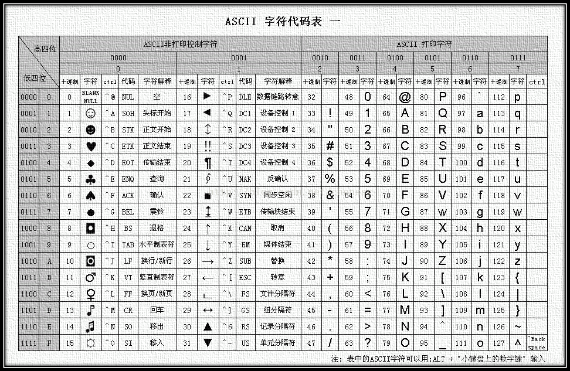

## 赋值运算符

对变量进行赋值的运算符.

`=`: 将等号右边的值赋予给左边, 要求左边必须是个容器.

其他赋值运算符.

`+=`: 左边的容器加上右边的值.

`-=`: 左边的容器减去右边的值.

`*=`: 左边的容器乘以右边的值.

`/=`: 左边的容器除以右边的值.

`%=`: 左边的容器求余右边的值.

使用这些运算符可以在对变量赋值时进行快速操作.

```javascript
let Num = 1
// 正常来说如果想要让Num加4, 要写成这样
Num = Num + 4
// 如果我们使用了赋值运算符可以简化为
Num += 4
```

## 一元运算符

众多的JS运算符可以根据所需表达式的个数, 分为一元运算符, 二元运算符, 三元运算符.

举个例子, `let Num = 10 + 20`就是二元运算符.

一元运算符有.

* 正负号.
* 自增.
  * 符号: `++`.
  * 作用: 让容器的值加1.
* 自减.
  * 符号: `--`.
  * 作用: 让容器的值减1.
* 非(取反).
  * 符号: `!`.
  * 详细请看下面的[逻辑运算符](#逻辑运算符).


自增和自减经常用于==计数==操作.

```javascript
let Num = 1
// 在我们学习赋值运算符前, 如果要给变量加+1, 是这样写的
Num = Num + 1
// 在我们学习赋值运算符后, 可以简化为
Num += 1
// 而现在, 我们可以使用一元运算符的自增再次简化, 写出这样
Num++
```

:::warning
无论是自增和还是自减, 单次只能+1或-1, 不能自定义值.
:::

### 扩展

我们可以分别做两个小实验.

前置自增.

```javascript
let Num = 1
console.log(Num) // 1
console.log(Num++) // 1
console.log(Num) // 2
```

后置自增.

```javascript
let Num = 1
console.log(Num) // 1
console.log(++Num) // 2
console.log(Num) // 2
```

看出什么问题了么, 是的在执行自增或自减时, 一元运算符的位置会导致输出的结果不一致, 这个现象其实很好理解.

我们先来讲前置自增`Num++`, 可以看见容器是在一元运算符的左侧的, 如果这个时候我们打印返回的值, 系统会先输出变量`Num`后在执行`++`.

也就是说, `console.log(Num++)`输出的是变量`Num`的值, 并不是`Num++`的结果.

由此, 我们可以推断出, 后置自增`console.log(++Num)`是先执行了`++`, 然后在输出变量`Num`的.

另外`++Num++`这种写法是不允许的, 会报错.

这个扩展只需要理解即可, 在实际开发中, 不会输出一元运算符时容器的值的, 都是直接写`Num++`.

### 来让我考考你

```javascript
let Num = 1
console.log(Num++ + ++Num + Num + Num--)
console.log(Num)
```

请充当一下人形解析器(不做人了), 分别说出它输出了什么.

(点击显示答案)

答案: !!10, 2!!{.blur .click}

解析:

!!第一问: 1 + 3 + 3 + 3 = 10!!{.blur .click}

!!第二问: 1 + 1 = 2, 1 + 2 = 3, 3 - 1 = 2!!{.blur .click}

## 比较运算符

用于比较两个数据大小, 是否相等.

`>`: 左边是否大于右边.

`<`: 左边是否小于右边.

`>=`: 左边是否大于或等于右边.

`<=`: 左边是否小于或等于右边.

`==`: 左右两边是否相等.

`===`: 左右两边是否全等(类型和值都相等).

`!=`: 左右两边是否不相等.

`!==`: 左右两边是否不全等(类型和值都不相等).

比较的结果为布尔型, 要么是`true`, 要么是`false`.

混淆.

`=`单等于是赋值.

`==`双等于是判断.

`===`三等于是全等.

==开发中判断是否相等推荐使用全等号==.

```javascript
console.log(3 > 5) // false
console.log(3 >= 3) // true
console.log(2 == 2) // true
console.log(2 == "2") // true
console.log(2 === "2") // false
console.log(undefined == null) // true
console.log(undefined === null) // false
console.log(NaN == NaN) // false
// NaN 不等于任何值, 包括他自己
```

如果要比较的内容不是数值, 而是字符串.

那么会比较字符对应的 ASCII 码.

从左到右依次比较, 如果第一位为true, 进行比较下一位, 以此类推.



```javascript
console.log("a" < "b") // true
console.log("aa" < "ab") // true
console.log("aa" < "aac") // true
```

:::warning
* 尽量不要比较小数, 因为小数有精度问题.
* 不同类型之间比较会有隐式转换, 所以一般在开发中使用全等.
:::

## 逻辑运算符

如果想判断变量Num是否大于5且小于10, 该怎么写?

你可能会写成`5 < Num < 10`, 这是错误的.

正确的写法是`Num > 5 && Num < 10`.

这就是逻辑运算符, 用于解决多重条件判断.

逻辑运算符一共有3个.

* `&&`.
  * 名称: 与.
  * 日常读法: 并且.
  * 逻辑: 符号两边都为true时, 结果才为true.
* `||`
  * 名称: 或.
  * 日常读法: 或者.
  * 逻辑: 符号两边只要有一个为true, 结果就为true.
* `!`
  * 名称: 非.
  * 日常读法: 取反.
  * 逻辑: true 变 false, false 变 true.

```javascript
console.log(true && true) // true
console.log(false && true) // false
console.log(3 < 5 && 3 > 2) // true
console.log(3 < 5 && 3 < 2) // false
console.log(true || true) // true
console.log(false || true) // true
console.log(false || false) // false
console.log(!true) // false
console.log(!false) // true
```

## 运算符优先级

1. 括号 `()`.
2. 一元运算符 `++`, `--`, `!`.
3. 算术运算符 先乘除后加减.
4. 关系运算符 `>`, `<=`, `<`, `<=`.
5. 相等运算符 `==`, `!=`, `===`, `!==`.
6. 逻辑运算符 先`&&`后`||`.
7. 赋值运算符 `=`.
8. 逗号运算符 `, `.
