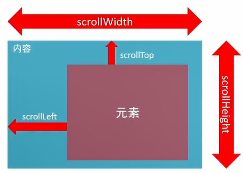

## 加载事件

### load

这个事件可以监听外部资源(图片, 外联CSS, JS等)加载完成.

这个是监听最大的`window`, 也就是说要等待网页所有东西都加载完.

:::demo
```html
<p>正在加载页面...</p>
<script>
  window.addEventListener("load", () => {
        document.querySelector("p").textContent = "页面加载完成"
    })
</script>
```
:::

这个是监听图片的, 其他视频外联CSS, JS等, 同理.

:::demo
```html
<p>正在加载图片...</p>

<script>
    document.querySelector("img").addEventListener("load", () => {
        document.querySelector("p").textContent = "图片加载完成"
    })
</script>
```
:::

### DOMContentLoaded

这个事件可以监听Html文档加载并解析完成, 无需等待样式表, 图片等资源.

这个事件只能监听`document`.

:::demo
```html
<p>正在加载html文档...</p>
<script>
  window.addEventListener("DOMContentLoaded", () => {
        document.querySelector("p").textContent = "html文档加载完成"
    })
</script>
```
:::

## 滚动事件

### scroll

这个事件可以监听所有带滚动条的元素, 比如文本框, div标签, 或者整个页面.

:::demo
```html
<style>
    body{
        height: 300px;
    }

    .test {
        width: 200px;
        height: 200px;
        background-color: #ff0000;
        overflow: auto;
    }

    .test div{
        height: 3000px;
    }
</style>
<div class="test"><div></div></div>
<p>等待滚动</p>
<script>
    window.addEventListener("scroll", () => {
        console.log("页面滚了")
    })
    document.querySelector(".test").addEventListener("scroll", () => {
        document.querySelector("p").textContent = "div标签滚过了"
    })
</script>
```
:::

### 扩展: 获取位置

Ps: 好难写...不是很好理解, 要经常实践.

`scrollLeft`和`scrollTop`属性.

用于获取被卷去的大小, 也就是获取元素内容往左, 往上滚出去看不到的距离.

这两个值是可以==读写==的.



#### 获取元素内部的滚动距离

:::demo
```html
<style>
    .test {
        width: 200px;
        height: 200px;
        background-color: #ff0000;
        overflow: auto;
    }

    .test div{
        height: 3200px;
    }
</style>
<div class="test">
    <div></div>
</div>
<p>等待滚动</p>
<script>
    const TEST = document.querySelector(".test")
    TEST.addEventListener("scroll", () => {
		document.querySelector("p").textContent = `div标签滚了${TEST.scrollTop}px`
    })
</script>
```
:::

#### 获取页面的滚动距离

:::tip
H5对于获取一些特定的元素, 有专门的写法.

`body`可以通过`document.body`获取.

`html`可以通过`document.documentElement`获取.
:::

```html
<style>
    body{
        height: 3000px;
    }
</style>
<script>
    window.addEventListener("scroll", () => {
        console.log(document.documentElement.scrollTop)
    })
</script>
```


#### 实践一下

做一个页面滚动到300就显示返回顶部按钮的Demo.

```html
<style>
    body {
        position: relative;
        height: 3000px;
    }
    div {
        position: absolute;
        top: 500px;
        background-color: #ff0000;
        display: none;
    }
</style>
<div>回到顶部</div>
<script>
    const DIV = document.querySelector("div")

    // 显示和隐藏 读取
    window.addEventListener("scroll", () => {
        if (document.documentElement.scrollTop >= 300) {
            DIV.style.display = "block"
        } else {
            DIV.style.display = "none"
        }
    })

    // 回到顶部 写入
    DIV.addEventListener("click", () => {
        document.documentElement.scrollTop = 0
    })
</script>
```


## 尺寸事件

### resize

这个事件看见监听窗口尺寸改变.

```html
<script>
    window.addEventListener("resize", () => {
        console.log("窗口尺寸改变")
    })
</script>
```


### 扩展:获取宽高

Ps: 好难写...不是很好理解, 要经常实践.

#### client

`clientWidth`和`clientHeight`属性.

用于获取元素的内部宽高.

如果元素是隐藏的, 获取到的值为0.

这个属性是只读的, 不能进行写入.

* 包含.
    * 内容的宽高.
    * 填充(`padding`).
* 不包含.
    * 边框(`border`).
    * 外边距(`margin`).
    * 滚动条.

#### offset

`offsetWidth`和`offsetHeight`属性.

用于获取元素的布局宽高.

如果元素是隐藏的, 获取到的值为**0**.

这个属性是**只读**的, 不能进行**写入**.

* 包含.
    * 内容的宽高.
    * 填充(`padding`).
    * 边框(`border`).
    * 滚动条.
* 不包含.
    * 外边距(`margin`).

#### 区别

:::demo
```html
<style>
    .a {
        width: 200px;
        height: 100px;
        padding: 20px;
        border: 5px solid black;
        margin: 10px;
        overflow: auto;
    }

    .b {
       height: 200px;
    }
</style>
<div class="a">
	<div class="b">滚动条</div>
</div>
<p id="a">待滚</p>
<p id="b">待滚</p>
<script>
    const A = document.querySelector(".a")
    document.getElementById("a").textContent = `clientWidth: ${A.clientWidth}, clientHeight: ${A.clientHeight}`
    document.getElementById("b").textContent = `offsetWidth: ${A.offsetWidth}, offsetHeight: ${A.offsetHeight}`
</script>
```
:::

### 扩展:获取位置

`offsetTop`和`offsetLeft`属性.

用于获取元素位置, 看最近一级带有定位的祖先元素.

这个属性是只读的, 不能进行写入.

:::demo
```html
<style>
    div {
        width: 200px;
        height: 100px;
        padding: 20px;
        border: 5px solid black;
        margin: 10px;
    }
</style>
<p>等待滚动</p>
<div></div>
<script>
    const TEST = document.querySelector("div")
	document.querySelector("p").textContent = `offsetTop: ${TEST.offsetTop}, offsetLeft: ${TEST.offsetLeft}`
</script>
```
:::

### 扩展: 一键获取位置和尺寸

`getBoundingClientRect()`

这个方法可以一次性获取元素的位置信息尺寸信息的对象.

:::demo
```html
<style>
    div {
        width: 200px;
        height: 100px;
        padding: 20px;
        border: 5px solid black;
        margin: 10px;
    }
</style>
<p>等待滚动</p>
<div></div>
<script>
    const TEST = document.querySelector("div")
	document.querySelector("p").textContent = `offsetWidth: ${TEST.offsetWidth}, offsetHeight: ${TEST.offsetHeight}`
</script>
```
:::


