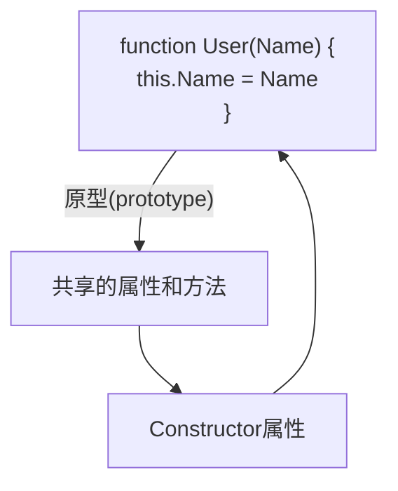
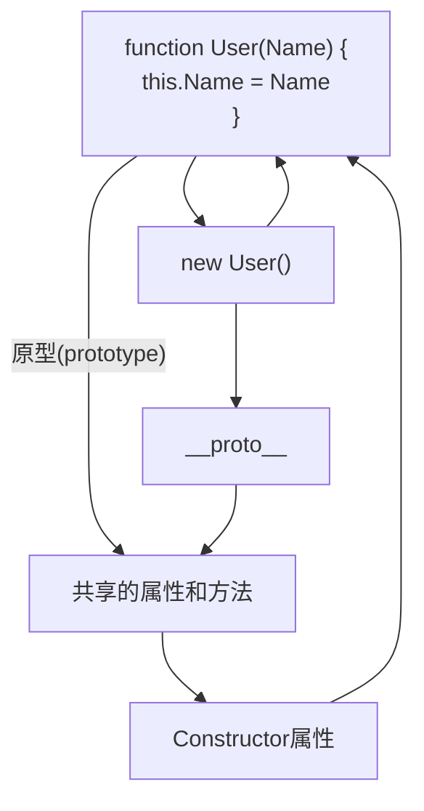
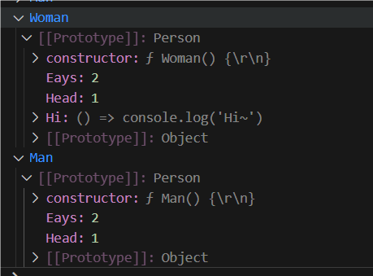
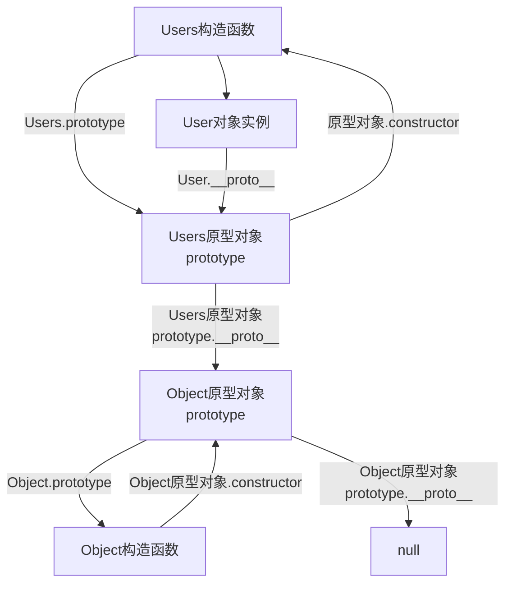

> 如果不动, 请自行查询文档, 因为我感觉我写不明白(抱歉).

* 构造函数通过原型分配的函数是所有对象所==共享的==.
* JS规定, 每一个构造函数都有一个`prototype`属性, 指向另一个对象, 所以我们也称为原型对象.
* 这个对象可以挂载函数, 对象实例化不会多次创建原型上函数, 节约内存.
* 我们可以把那些不变的方法, 直接定义在`prototype`对象上, 这样所有对象的实例化就可以共享这些方法.
* 构造函数可原型对象中的`this`都指向实例化的对象.

```javascript
function user(Name, Age) {
    this.Name = Name
    this.Age = Age
}
// 直接写在prototype对象上
user.prototype.Hi = () => console.log("Hi~")
const Elake = new user("洱海", 18)
Elake.Hi()
// Hi~
```

## Constructor 属性

每个原型对象里面都有个`constructor`属性(`constructor`构造函数).

这个属性==指向==该原型对象的==构造函数==.

要不我给你写个图, 大概就是这么个情况.



```javascript
function user(Name) {
    this.Name = Name
}
console.log(user.prototype.constructor === user)
// true
```

### 重新指回原型构造函数

先来看几个代码块.

```javascript
function test() {
}
test.prototype.A = () => console.log("A函数")
test.prototype.B = () => console.log("B函数")
test.prototype.C = () => console.log("C函数")
test.prototype.D = () => console.log("D函数")
const T = new Test()
T.A()
T.B()
T.C()
T.D()
```

这样一个个加是不是太麻烦了.

```javascript
function test() {
}
console.log(test.prototype)
test.prototype = {
    A: () => console.log("A函数"),
    B: () => console.log("B函数"),
    C: () => console.log("C函数"),
    D: () => console.log("D函数")
}
console.log(test.prototype)
const T = new Test()
T.A()
T.B()
T.C()
T.D()
```


这样有虽然方便了, 但有一个问题了, `constructor`被覆盖了, 这个构造函数的原型属于谁的, 就不知道了.

所以要重新指回这个原型的构造函数.

```javascript
function test() {
}
console.log(test.prototype)
Test.prototype = {
    constructor: test,
    A: () => console.log("A函数"),
    B: () => console.log("B函数"),
    C: () => console.log("C函数"),
    D: () => console.log("D函数")
}
console.log(test.prototype)
const T = new Test()
T.A()
T.B()
T.C()
T.D()
```


## 对象原型

:::tip
原型对象不等于对象原型.
:::

每个对象都有一个属性`__proto__`指向构造函数的`prototype`原型对象, 之所以我们对象可以使用构造函数`prototype`原型对象的属性和方法, 就是因为对象有`__proto__`原型的存在.



:::warning
* `__proto__`是JS非标准属性.
* `[[prototype]]`和`__proto__`意义相同.
* 用来表明当前实例对象指向哪个原型对象`prototype`.
* `__proto__`对象原型里面也有一个`constructor`属性, ==指向创建该实例对象的构造函数==.
:::

```javascript
function test() {
}
const T = new test()
console.log(T.__proto__ === test.prototype)
// true
console.log(T.__proto__.constructor === test)
// true
```

## 原型继承

继承是面向对象编程的一个特征, 通过继承进一步提高代码封装的程度, JS中大多是借助原型对象实现继承的特征.

```javascript
// 女人
function woman() {
    this.Eays = 2
    this.Head = 1
}
const A = new woman()
console.log(A)
// Woman {Eays: 2, Head: 1}

// 男人
function man() {
    this.Eays = 2
    this.Head = 1
}
const B = new man()
console.log(B)
// Man {Eays: 2, Head: 1}
```

不管是女的还是男的, 都有2只眼睛, 1个头, 所以可以共用.

```javascript
// 公共
const PERSON = {
    Eays: 2,
    Head: 1
}

// 女人
function woman() {
}
// 继承PERSON
woman.prototype = PERSON
woman.prototype.constructor = woman
const A = new woman()
console.log(A)

// 男人
function man() {
}
// 继承PERSON
man.prototype = PERSON
man.prototype.constructor = man
const B = new man()
console.log(B)
```

这种方法还有一个坏处, 如果属性一样, 方法不一样, 加入女人要加一个`Hi`的方法, 男人不需要, 你怎么办.

```javascript
// 公共
function person() {
    this.Eays = 2
    this.Head = 1
}

// 女人
function woman() {
}
// 继承PERSON
woman.prototype = new person()
woman.prototype.constructor = woman
woman.prototype.Hi = () => console.log("Hi~")
const A = new woman()
console.log(A)


// 男人
function man() {
}
// 继承PERSON
man.prototype = new person()
man.prototype.constructor = man
const B = new man()
console.log(B)
```



## 原型链

基于原型对象的继承使得不同构造函数的原型对象关联在一起, 并且这种关联的关系是一种链状的结构, 我们将原型对象的链状结构关系称为原型链.



### 查找规则

1. 当访问一个对象的属性(包括方法时), 首先查找这个==对象自身==有没有该属性.
2. 如果没有就查找它的原型(也就是`__proto__`指向的**`protorype`原型对象**).
3. 如果还没有就查找原型对象的原型(==Object的原型对象==).
4. 以此类推, 直到找到Object为止(==null==).
5. `__proto__`对象原型的意义就在于为对象成员查找机制提供一个方向, 或者说一条路线.
6. , 可以使用`instanceof`运算符用于检测构造函数的`protorype`属性是否出现在某个实例对象的原型链上.

```javascript
function test() {
}
const T = new test()

console.log(T instanceof test)
// true
console.log(T instanceof Object)
// true
console.log(T instanceof Array)
// false
```
