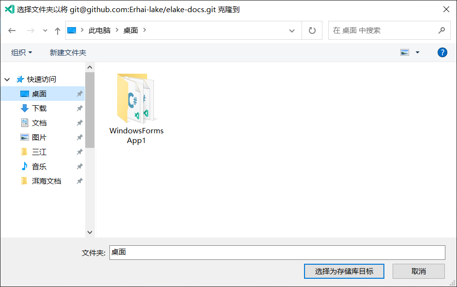

## 在VS Code配置Git

安装好 VS Code 和 Git 后, VS Code会自动识别Git的位置, 如果没有自动识别到, 则需要手动配置.


点击后会打开一个`settings.json`的文件, 并且会自动写入配置.


如果没有请自行输入:

```json
{
	"git.path": "Git路径, 例如:C:/Program Files/Git/cmd/git.exe"
}
```

## 克隆仓库

点击克隆.


在弹窗输入或选择远端仓库.


选择保存的位置(不需要新建文件夹).



## 其他功能的使用方法

在VS Code的Git下拉列表中, 是VS Code现支持的所有功能(遇到BUG还请用命令行).

不知道有没有必要写, 需要的可以告知一声, 要的人多的话, 应该会更新.
