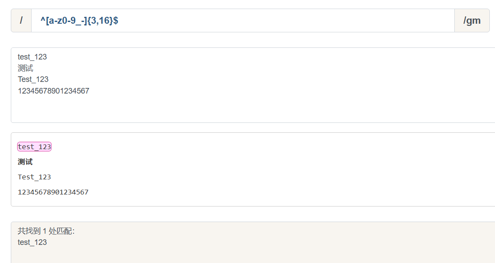

> 参考: [正则表达式完整教程 SegmentFault](https://segmentfault.com/a/1190000040988916)

**正则表达式**(Regular Expression)是一种**文本模式**, 包括普通字符(例如a到z之间的字母)和特殊字符(称为**元字符**), 可以用来描述和匹配字符串的特定模式.

**正则表达式**是一种用于模式匹配和搜索文本的工具.

**正则表达式**提供了一种灵活且强大的方式来查找, 替换, 验证和提取文本数据.

**正则表达式**可以应用于各种编程语言和文本处理工具中, 如 **JavaScript**, **Python**, **Java**等.

:::note
正则表达式是匹配模式, 要么匹配字符, 要么匹配位置.请记住这句话.

关于正则如何匹配字符, 大部分人都觉得这块比较杂乱.

毕竟元字符太多了, 看起来没有系统性, 不好记(~~我也不好写...~~).
:::

[在线测试网站](https://www.jyshare.com/front-end/854/)

[可视化工具](https://www.jyshare.com/front-end/7625/)

## 例子

只能输入英文字符, 数字或者下划线, 且长度在3~16字符之间

`/^[a-z0-9_-]{3,16}$/`

匹配邮箱

`/\b[\w.%+-]+@[\w.-]+\.[a-zA-Z]{2,6}\b/`

