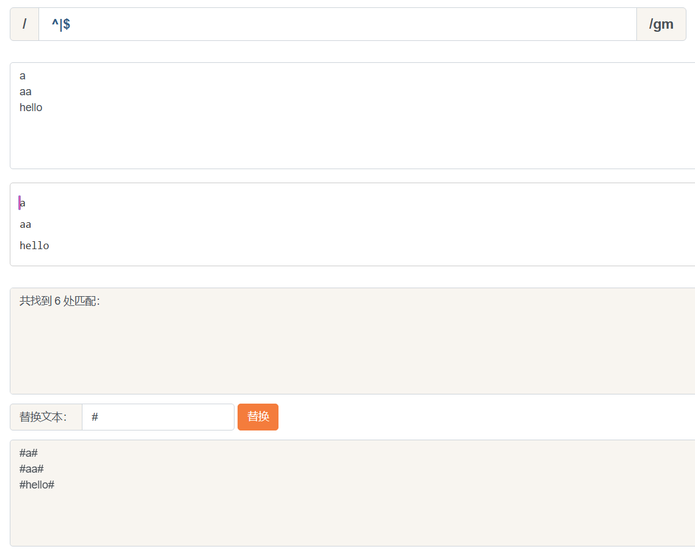
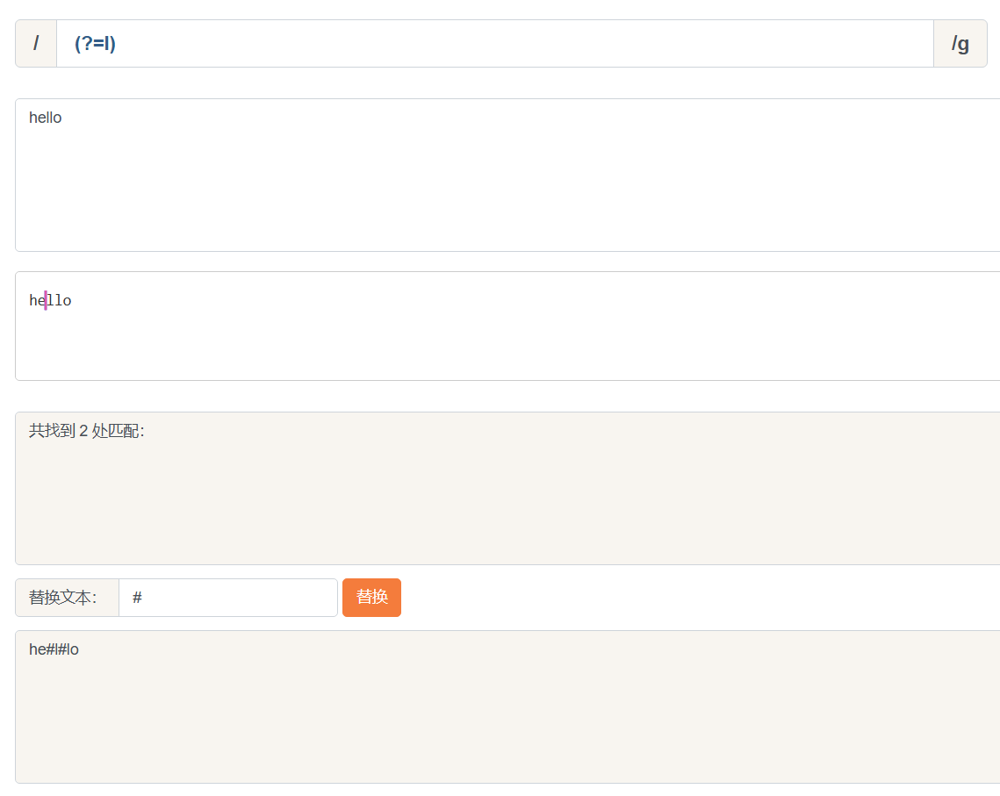
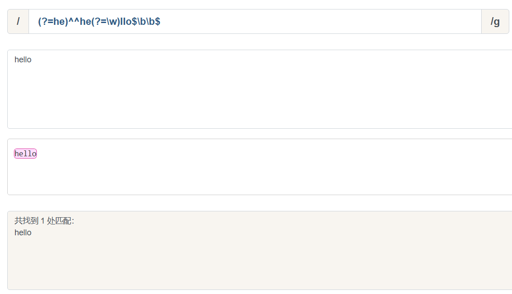

:::note
再次强调, 正则表达式是匹配模式, 要么匹配字符, 要么匹配位置. 请记住这句话.

然而大部分人学习正则时, 对于匹配位置的重视程度没有那么高.
:::

## 什么是位置

位置是相邻字符之间的位置. 例如, 下图中箭头所指的地方.

## 如何匹配位置

共有6个锚字符.

`^`, `$`, `\b`, `\B`, `(?=p)`, `(?!p)`.

### 前两个

`^`(脱字符)匹配开头, 在多行匹配中匹配行开头.

`$`(美元符号)匹配结尾, 在多行匹配中匹配行结尾.

### 中间两个

`\b`是单词边界, 具体就是`\w`和`\W`之间的位置, 也包括`\w`和`^`之间的位置, 也包括`\w`和`$`之间的位置.

比如一个文件名是`[JS] Demo.js`中的`\b`.

为什么是这样呢?仔细看看呢~

首先, 我们知道, `\w`是字符组`[0-9a-zA-Z_]`的简写形式, 即`\w`是字母数字或者下划线的中任何一个字符. 而`\W`是排除字符组`[^0-9a-zA-Z_]`的简写形式, 即`\W`是`\w`以外的任何一个字符.

此时我们可以看看`[#JS#] #Demo#.#js#`中的每一个`#`是怎么来的.

* 第一个`#`, 两边是`[`与`J`, 是`\W`和`\w`之间的位置.
* 第二个`#`, 两边是`S`与`]`, 也就是`\w`和`\W`之间的位置.
* 第三个`#`, 两边是空格与`D`, 也就是`\W`和`\w`之间的位置.
* 第四个`#`, 两边是`o`与`.`, 也就是`\w`和`\W`之间的位置.
* 第五个`#`, 两边是`.`与`j`, 也就是`\W`和`\w`之间的位置.
* 第六个`#`, 其对应的位置是结尾, 但其前面的字符`s`是`\w`, 即`\w`和`$`之间的位置.

知道了`\b`的概念后, 那么`\B`也就相对好理解了.

`\B`就是`\b`的反面的意思.非单词边界/例如在字符串中所有位置中.扣掉`\b`.剩下的都是`\B`的.

具体说来就是`\w`与`\w`, `\W`与`\W`, `^`与`\W`, `\W`与`$`之间的位置.

比如上面的例子, 把所有`\B`替换成`#`.

### 后两个

`(?=p)`, 其中`p`是一个子模式, 即`p`前面的位置.

比如`(?=l)`, 表示`l`字符前面的位置, 例如.

而`(?!p)`就是`(?=p)`的反面意思.

## 位置的特性

对于位置的理解, 我们可以理解成空字符` ""`.

比如`"hello"`字符串等价于如下的形式.

`"hello" == "" + "h" + "" + "e" + "" + "l" + "" + "l" + "o" + "";`.

也就是.

`"hello" == "" + "" + "hello"`.

因此, 把`/^hello$/`写成`/^^hello?$/`, 是没有任何问题的.

:::note
如果你想写屎山代码, 甚至可以写成更复杂.

`/(?=he)^^he(?=\w)llo$\b\b$/`.

:::

也就是说字符之间的位置, 可以写成多个.

把位置理解空字符, 是对位置非常有效的理解方式.
