学习正则表达式, 是需要懂点儿匹配原理的.

而研究匹配原理时, 有两个字出现的频率比较高: **回溯**.

假设我们的正则是`/ab{1, 3}c/`, 其可视化形式是.

## 没有回溯的匹配

而当目标字符串是`abbbc`时, 就没有所谓的**回溯**.其匹配过程如下:

| 步骤 |                                                正则                                                |                                                文本                                                |
|:--:|:------------------------------------------------------------------------------------------------:|:------------------------------------------------------------------------------------------------:|
| 1  |  | 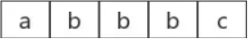 |
| 2  |  | 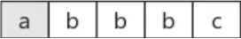 |
| 3  |  |  |
| 4  |  |  |
| 5  |  |  |
| 6  |  |  |

其中子表达式`b{1, 3}`表示`b`字符连续出现1到3次.

## 有回溯的匹配

如果目标字符串是`abbc`中间就有**回溯**.

| 步骤 |                                                正则                                                |                                                文本                                                |
|:--:|:------------------------------------------------------------------------------------------------:|:------------------------------------------------------------------------------------------------:|
| 1  |  |  |
| 2  |  | 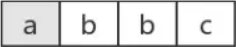 |
| 3  |  |  |
| 4  |  | 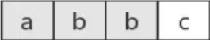 |
| 5  |  | 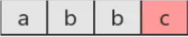 |
| 6  |  |  |
| 7  |  |  |

图中第5步有红颜色, 表示匹配不成功.

此时`b{1,3}`已经匹配到了2个字符`b`, 准备尝试第三个时, 结果发现接下来的字符是`c`.

那么就认为`b{1,3}`就已经匹配完毕.

然后状态又回到之前的状态(即第6步, 与第4步一样), 最后再用子表达式`c`, 去匹配字符`c`.当然, 此时整个表达式匹配成功了.

图中的第6步, 就是**回溯**.

## 常见的回溯形式

正则表达式匹配字符串的这种方式, 有个学名, 叫回溯法.

回溯法也称试探法, 它的基本思想是: 从问题的某一种状态(初始状态)出发, 搜索从这种状态出发所能达到的所有**状态**, 当一条路走到尽头的时候(不能再前进), 再后退一步或若干步, 从另一种可能**状态**出发, 继续搜索, 直到所有的**路径**(状态)都试探过.

这种不断**前进**, 不断**回溯**寻找解的方法, 就称作**回溯法**.

本质上就是深度优先搜索算法. 其中退到之前的某一步这一过程, 我们称为==回溯==. 从上面的描述过程中, 可以看出, 路走不通时, 就会发生回溯. 即, 尝试匹配失败时, 接下来的一步通常就是回溯.

道理懂了, 那什么地方会产生呢?

### 贪婪量词

之前的例子都是贪婪量词相关的.比如`b{1,3}`, 因为其是贪婪的, 尝试可能的顺序是从多往少的方向去尝试.

首先会尝试`bbb`, 然后再看整个正则是否能匹配.不能匹配时, 吐出一个`b`, 即在`bb`的基础上, 再继续尝试. 如果还不行, 再吐出一个, 再试. 如果还不行呢? 只能说明匹配失败了.

虽然局部匹配是贪婪的, 但也要满足整体能正确匹配. 否则, 皮之不存, 毛将焉附?

此时我们不禁会问, 如果当多个贪婪量词挨着存在, 并相互有冲突时, 此时会是怎样?

答案是, 先下手为强! 因为深度优先搜索.

其中, 前面的`\d{1,3}`匹配的是`123`后面的`\d{1,3}`匹配的是`45`.

### 惰性量词

惰性量词就是在贪婪量词后面加个问号. 表示尽可能少的匹配, 比如:

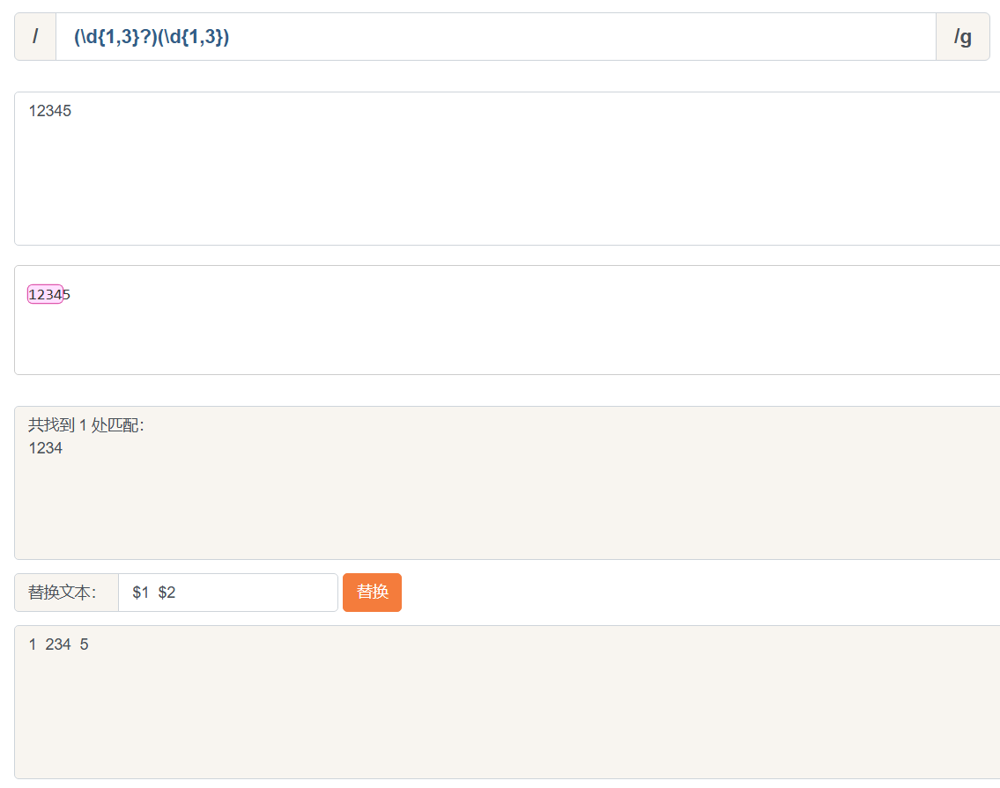

其中`\d{1,3}?`只匹配到一个字符`1`, 而后面的`\d{1,3}`匹配了`234`.

虽然惰性量词不贪, 但也会有回溯的现象. 比如正则是:

目标字符串是`12345`, 匹配过程是:

| 步骤 |                                                正则                                                |                                                文本                                                |
|:--:|:------------------------------------------------------------------------------------------------:|:------------------------------------------------------------------------------------------------:|
| 1  |  |  |
| 2  |  |  |
| 3  |  |  |
| 4  |  |  |
| 5  |  |  |
| 6  |  |  |
| 7  |  |  |
| 8  |  | 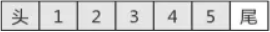 |
| 9  |  |  |

知道你不贪, 很知足, 但是为了整体匹配成, 没办法, 也只能给你多塞点了.因此最后`\d{1,3}?`匹配的字符是`12`, 是两个数字, 而不是一个.

### 分支结构

我们知道分支也是惰性的, 比如`/can|candy/`, 去匹配字符串`candy`, 得到的结果是`can`, 因为分支会一个一个尝试, 如果前面的满足了, 后面就不会再试验了.

分支结构, 可能前面的子模式会形成了局部匹配, 如果接下来表达式整体不匹配时, 仍会继续尝试剩下的分支. 这种尝试也可以看成一种回溯.

比如正则.

目标字符串是`candy`, 匹配过程.

| 步骤 |                                                正则                                                |                                                文本                                                |
|:--:|:------------------------------------------------------------------------------------------------:|:------------------------------------------------------------------------------------------------:|
| 1  |  |  |
| 2  |  |  |
| 3  | 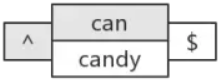 |  |
| 4  | 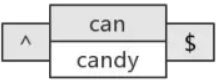 |  |
| 5  | 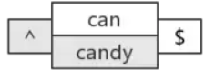 |  |
| 6  |  | 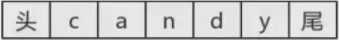 |

上面第5步, 虽然没有回到之前的状态, 但仍然回到了分支结构, 尝试下一种可能.所以, 可以认为它是一种回溯的.
