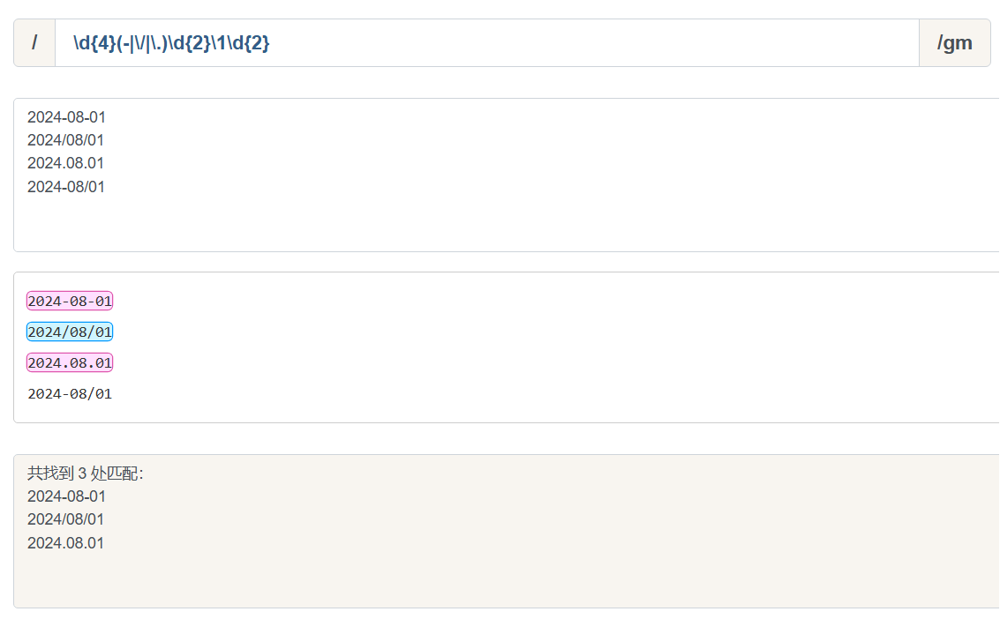
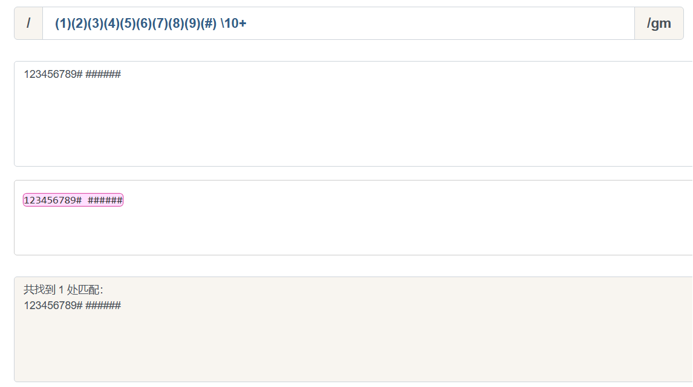

不管哪门语言中都有括号. 正则表达式也是一门语言, 而括号的存在使这门语言更为强大.

对括号的使用是否得心应手, 是衡量对正则的掌握水平的一个侧面标准.

括号的作用, 其实三言两语就能说明白, 括号提供了分组, 便于我们引用它.

引用某个分组, 会有两种情形: 在JavaScript里引用它, 在正则表达式里引用它.

本章内容虽相对简单, 但我也要写长点.

## 分组

我们知道`/a+/`匹配连续出现的`a`, 而要匹配连续出现的`ab`时, 需要使用`/(ab)+/`.

其中括号是提供分组功能, 使量词`+`作用于`ab`这个整体.

## 分支结构

而在多选分支结构`(p1|p2)`中, 此处括号的作用也是不言而喻的, 提供了子表达式的所有可能.

比如, 要匹配如下的字符串.

`I love JavaScript`.

`I love Java`.

如果去掉正则中的括号, 即`/^I love JavaScript|Java$/`, 匹配字符串是`I love JavaScript`和`Java`, 当然这不是我们想要的.

## 引用分组

这是括号一个重要的作用, 有了它, 我们就可以进行数据提取, 以及更强大的替换操作.

而要使用它带来的好处, 必须配合使用实现环境的API.

以日期为例. 假设格式是yyyy-mm-dd的, 我们可以先写一个简单的正则.

`/\d{4}-\d{2}-\d{2}/`然后再修改成括号版的`/(\d{4})-(\d{2})-(\d{2})/`.

这时, 就可以通过`$1`, `$2`, `$3`来提取数据了.

## 反向引用

除了使用相应`API`来引用分组, 也可以在正则本身里引用分组.但只能引用之前出现的分组, 即反向引用.

还是以日期为例.

`2024-08-01`.

`2024/08/01`.

`2024.08.01`.

`2024-08/01`.

最先可能想到的正则是`/\d{4}(-|\/|\.)\d{2}(-|\/|\.)\d{2}/`.

其中`/`和`.`需要转义. 虽然匹配了要求的情况, 但也匹配`2024-08/01`这样的数据.

假设我们想要求分割符前后一致怎么办? 此时需要使用反向引用.

`/\d{4}(-|\/|\.)\d{2}\1\d{2}/`.

注意里面的`\1`, 表示的引用之前的那个分组`(-|\/|\.)`. 不管它匹配到什么(比如`-`), `\1`都匹配那个同样的具体某个字符.

我们知道了`\1`的含义后, 那么`\2`和`\3`的概念也就理解了, 即分别指代第二个和第三个分组.

看到这里, 此时, 恐怕你会有三个问题.

### 括号嵌套怎么办?

以左括号(开括号)为准.

`/^((\d)(\d(\d)))\1\2\3\4$/`.

我们可以看看这个正则匹配模式.

* 第一个字符是数字, 比如说`1`.
* 第二个字符是数字, 比如说`2`.
* 第三个字符是数字, 比如说`3`.
* 接下来的是`\1`, 是第一个分组内容, 那么看第一个开括号对应的分组是什么, 是`123`.
* 接下来的是`\2`, 找到第2个开括号, 对应的分组, 匹配的内容是`1`.
* 接下来的是`\3`, 找到第3个开括号, 对应的分组, 匹配的内容是`23`.
* 最后的是`\4`, 找到第3个开括号, 对应的分组, 匹配的内容是`3`.

这个问题, 估计仔细看一下, 就该明白了.

### `\10`表示什么呢

另外一个疑问可能是, 即`\10`是表示第10个分组, 还是`\1`和`0`呢?

答案是前者, 虽然一个正则里出现`\10`比较罕见.

`/(1)(2)(3)(4)(5)(6)(7)(8)(9)(#) \10+/`.

### 引用不存在的分组会怎样?

因为反向引用, 是引用前面的分组, 但我们在正则里引用了不存在的分组时, 此时正则不会报错, 只是匹配反向引用的字符本身.例如`\2`, 就匹配`\2`.

:::warning
`\2`表示对`2`进行了转意.
:::

## 非捕获分组

之前文中出现的分组, 都会捕获它们匹配到的数据, 以便后续引用, 因此也称他们是捕获型分组.

如果只想要括号最原始的功能, 但不会引用它. 就是既不在API里引用. 也不在正则里反向引用.

此时可以使用非捕获分组`(?:p)`, 例如本文第一个例子可以修改为.

`/(?:ab)+/g`.
